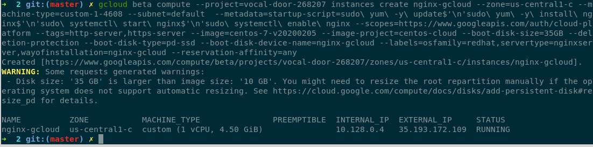
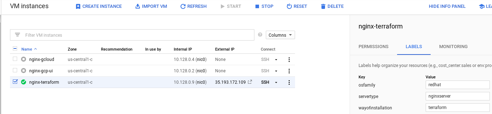
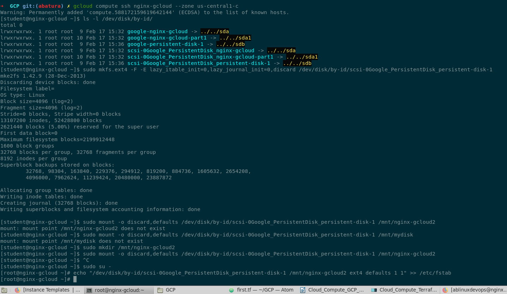
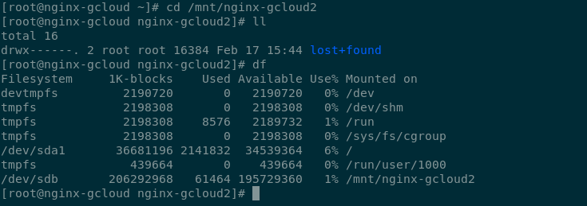
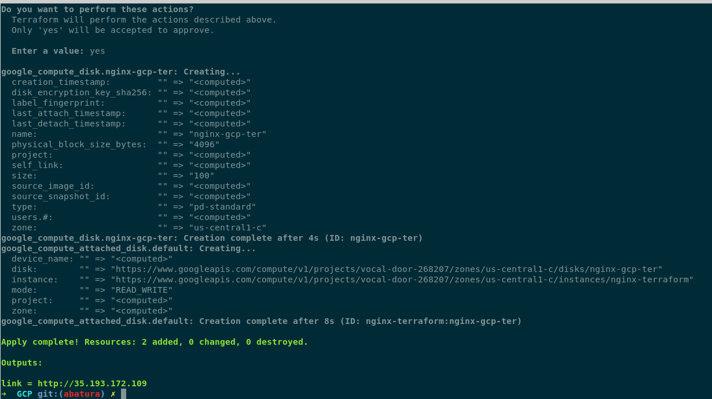

# google-cloud-module

<dl>
  <dt>Compute: Virtual Machine creation</dt>
  <dd>Home task</dd>
</dl>

#### Here's Andrei Batura GCP hometask 1 report:

1) Create Virtual Machine in Google cloud :  
 

2) Create Persistent Disk and attach it to one of existing Virtual machine :  
 
 

