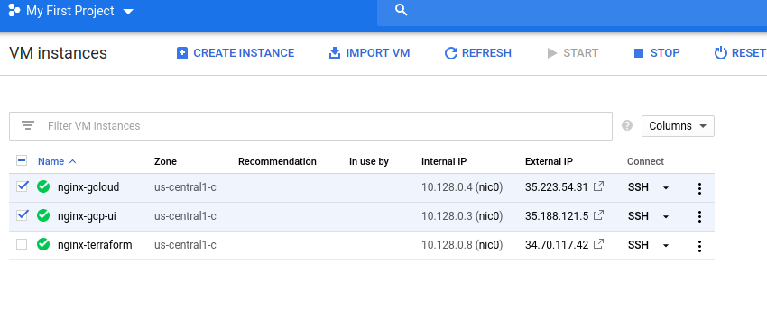
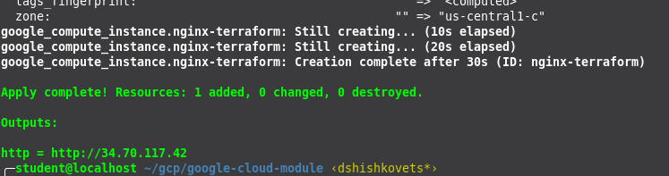
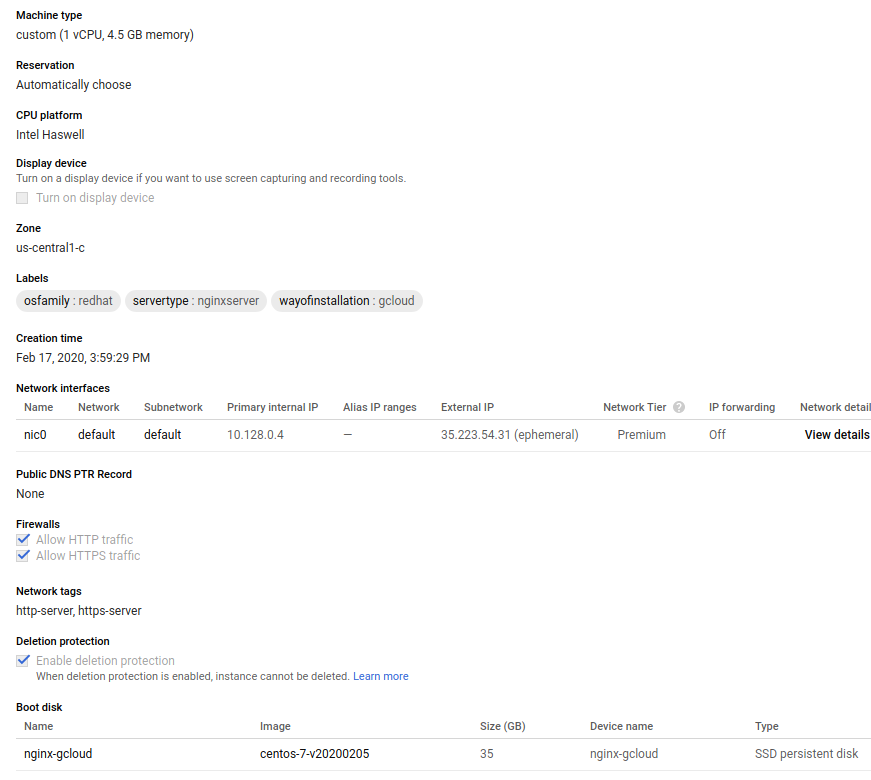
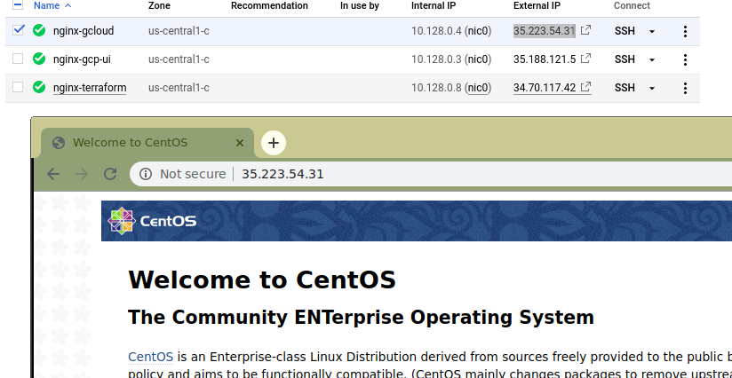
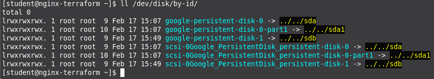
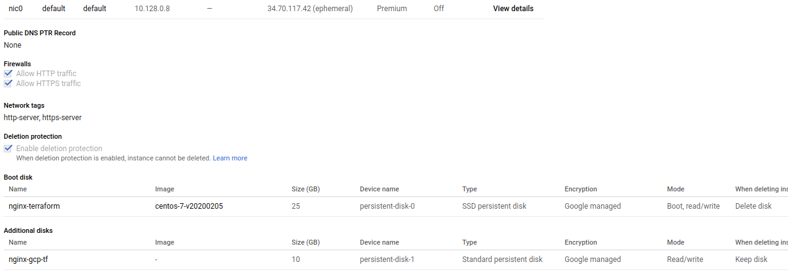

# google-cloud-module

Task 1
1. Create Virtual Machine in Google cloud by the following ways:
* gcp-ui (complete Lab: google codelabs: VM creation)
* gcloud
* terraform (all settings should be provided via variables (tfvars), add URL (“http://IP. Address/” to output )

Virtual Machine Properties:
  InstanceName : nginx-${creation-way}
  Region: us-central1
  Zone: us-central1-c
  Type: General Purpose, n1, 1CPU 4.5GB RAM, Disk SSD 35Gb;
  OS: Centos7
  Allow http,https traffic
  Labels:
    servertype=nginxserver
    osfamily=redhat
    wayofInstallation=${creation-way}

    The instance should be protected for deletion.
    
    VM should have the up and running Nginx (automatically provisioned after VM is started via yum, default configuration)
    The instance is running in default network

** Task 2**
Create Persistent Disk and attach it to one of existing Virtual machine (nginx-gcp-ui).
1. Complete Lab google codelabs: persistent disk with using your VM name

2. Create terraform configuration to do the same via terraform (use VM: nginx-gcp-terraform).

