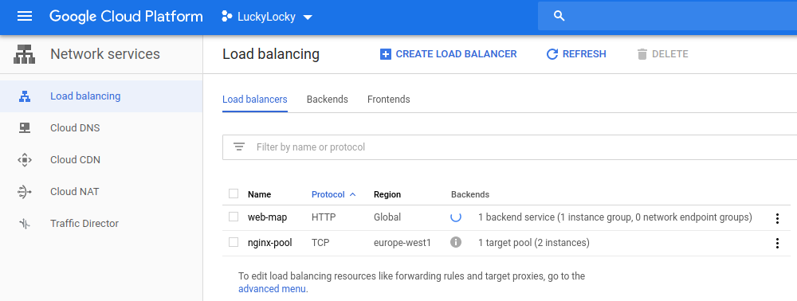
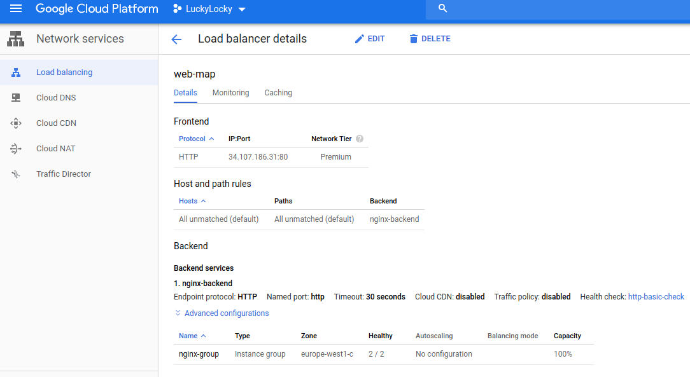
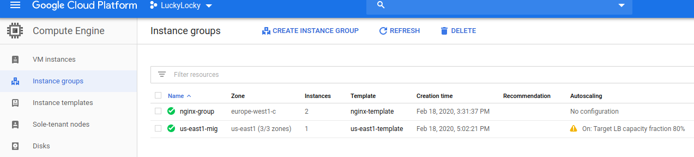
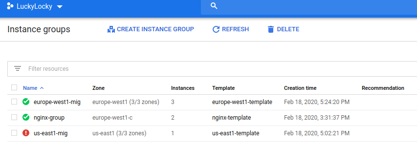
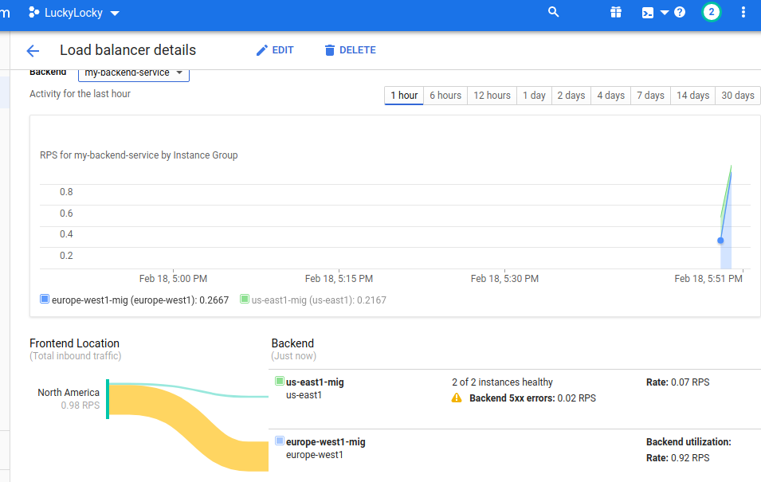
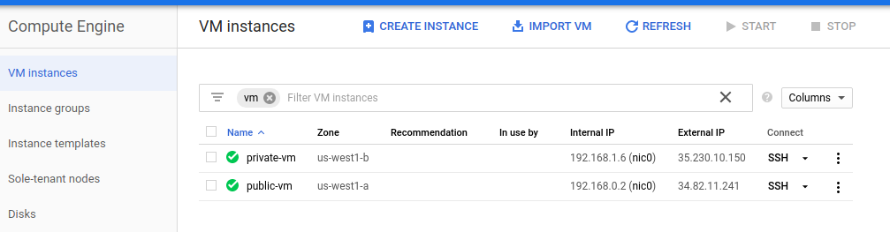
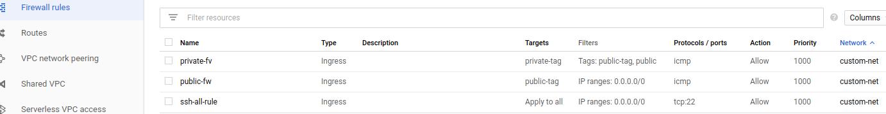
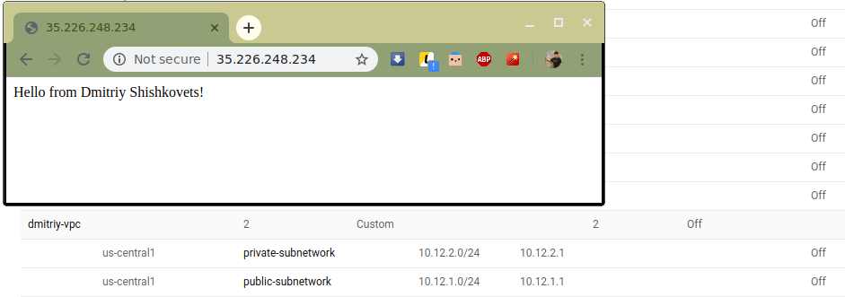

# google-cloud-module

<dl>
  <dt>Google Cloud Compute: NETWORKING </dt>
  
  <dd>Homework</dd>
</dl>

## Here's Dmitriy Shishkovets GCP Homework 3 report:

1) Setup Network and HTTP Load Balancers :  
 
   
2) Networking 101 codelab :   
   
   
   
3) Networking 102 codelab :  

    
    
 
4) Secure Instances and Apps with Custom Networks :

   
   
5) Create network configuration via Terraform:  

   
