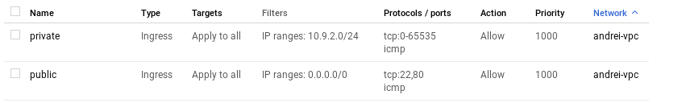

# google-cloud-module

<dl>
  <dt>Google Cloud Compute: NETWORKING </dt>
  
  <dd>Homework</dd>
</dl>

## Here's Andrei Batura GCP Homework 3 report:

1) Setup Network and HTTP Load Balancers :  
 

2) Networking 101 codelab :   
   
   
   
3) Networking 102 codelab :  
 Complete with some issueses. For instance 'gcloud compute addresses create web-ext-ip --region us-central1' command return
ERROR: (gcloud.compute.addresses.create) Could not fetch resource:
 - Quota 'STATIC_ADDRESSES' exceeded.  Limit: 1.0 in region us-central1.
4) Secure Instances and Apps with Custom Networks :
   

5) Create network configuration via Terraform:  
   
   
   
  
