# google-cloud-module

<dl>
  <dt>Google Cloud Compute: NETWORKING </dt>

  <dd>Homework</dd>
</dl>

## Here's Dmitriy Shishkovets GCP Homework 3 report:
***
**1. Task 1**

>We learn:
* How to access the Cloud Storage Browser in the Google Cloud Console.
* How to create a Cloud Storage bucket.
* How to upload objects to a Cloud Storage bucket.
* How to delete a Cloud Storage bucket and all the object it contains.

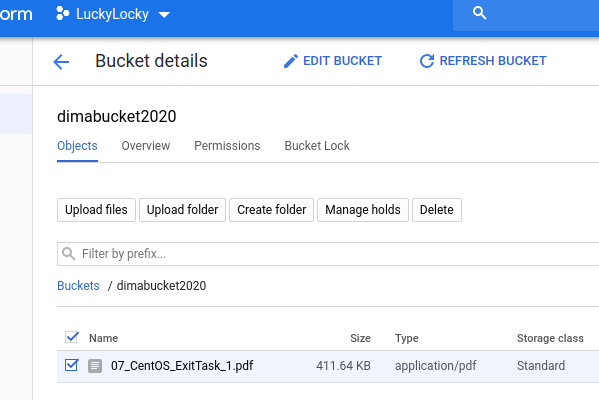 
***
**2.  Task 2**

>We learn how to:
* Create and interact with your first GCS bucket using the UI and Command Line tool
* Setup ACL bucket and file permissions
* How to use the online transfer tool
* Configure Lifecycle Management
* Setup IAM permissions

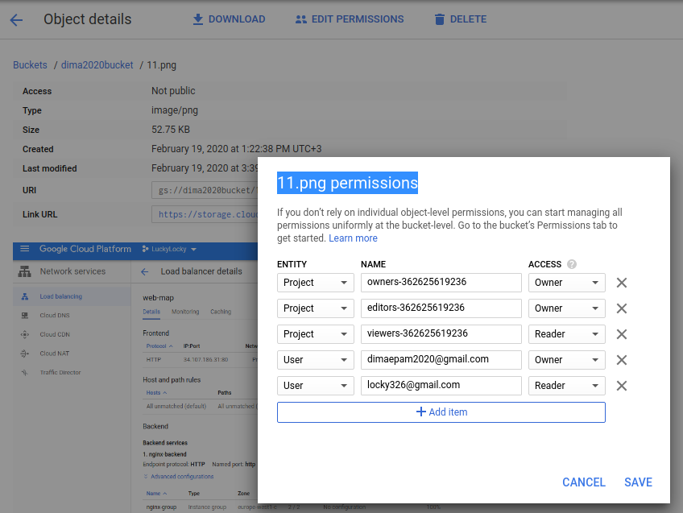   

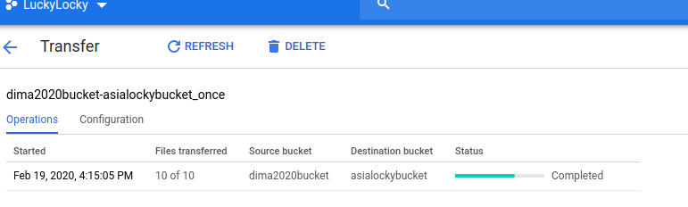   
***
**3.  Task 3**

>We learn how to:
* Create and use buckets
* Set access control lists to restrict access
* Use your own encryption keys
* Implement version controls
* Use directory synchronization
* Share a bucket across projects using Cloud IAM

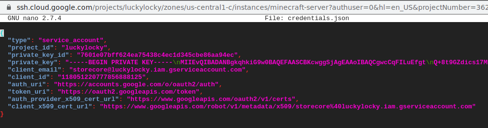   

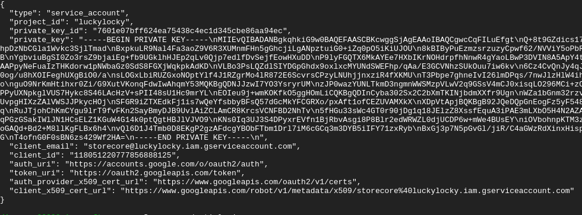   

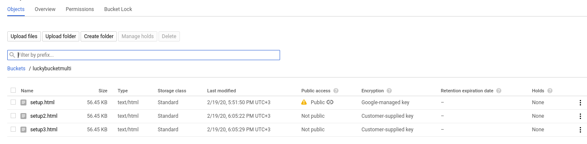   

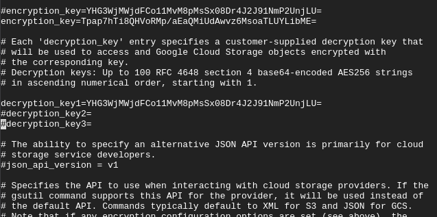   

   

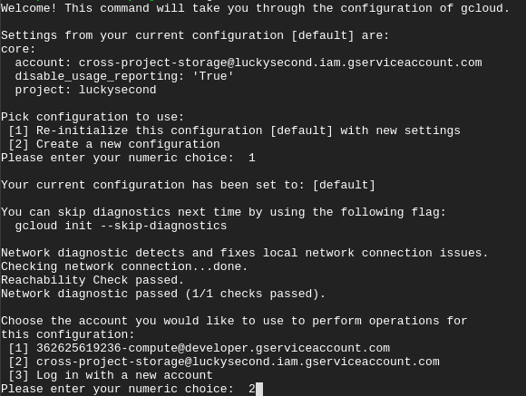   
***
**4.  Task 4**

>We learn :
* How to Create a CNAME record
* How to point that CNAME record at Google Cloud Storage.
* How to Create a Google Cloud Storage bucket named like your domain.
* How to Upload and set permissions on the static files for your website.
* How to Test your website.
* How to Add HTTPS support with a HTTPS LoadBalancer

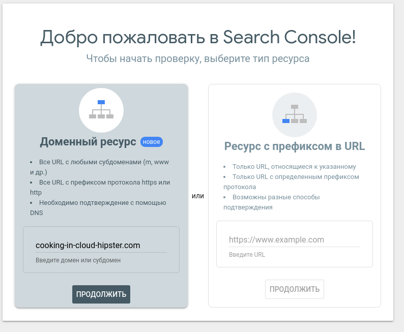   

   

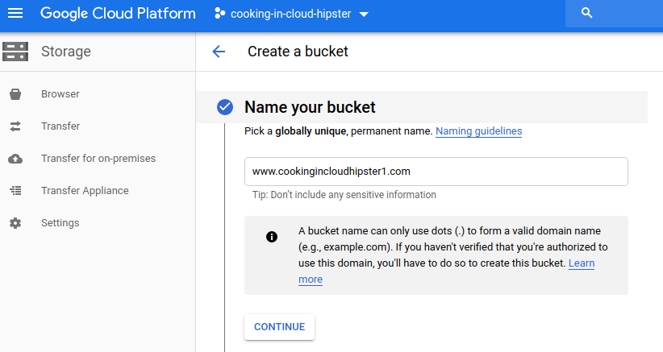   

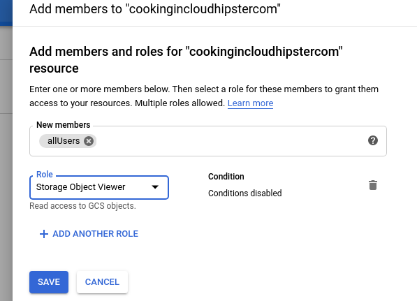   
***
**5.  Task 5**
>Create the following configuration via terraform:

>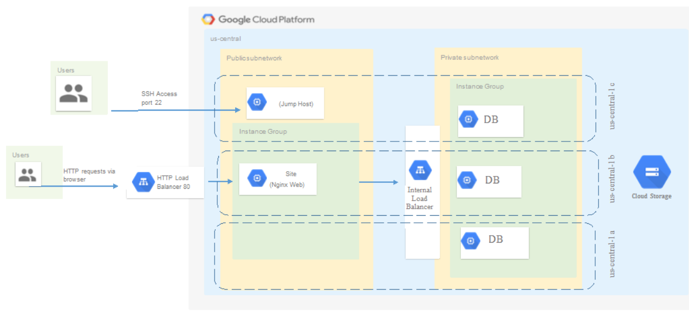   

>* Create Cloud Storage to and configure terraform backend to use remote storage (gcs)
>* Network configuration should be taken from previous task and extended.

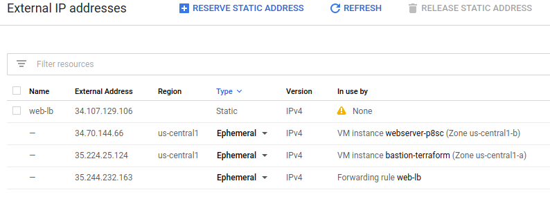   

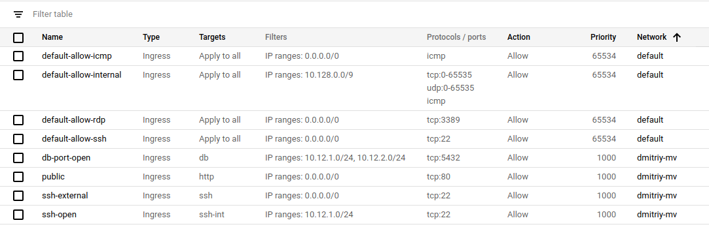   

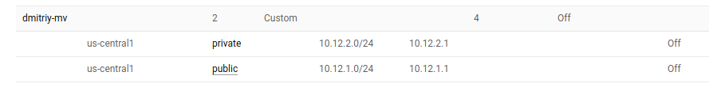   

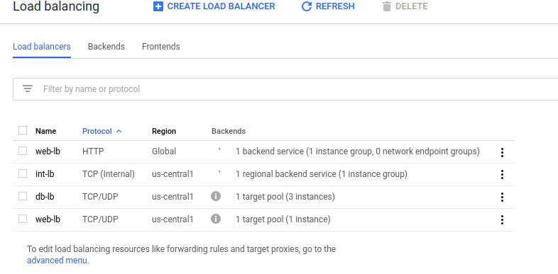   

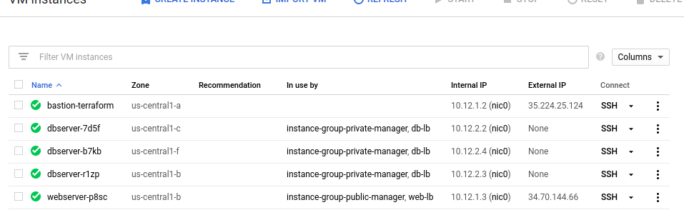   

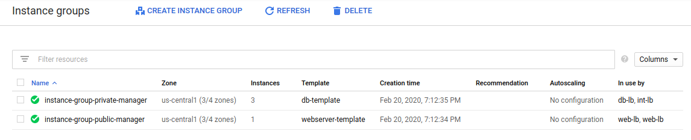   

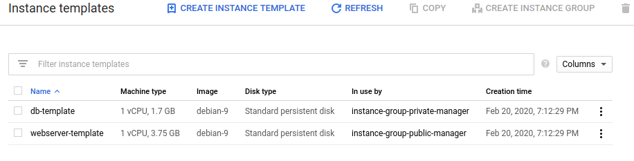   

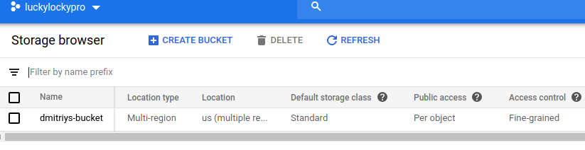   

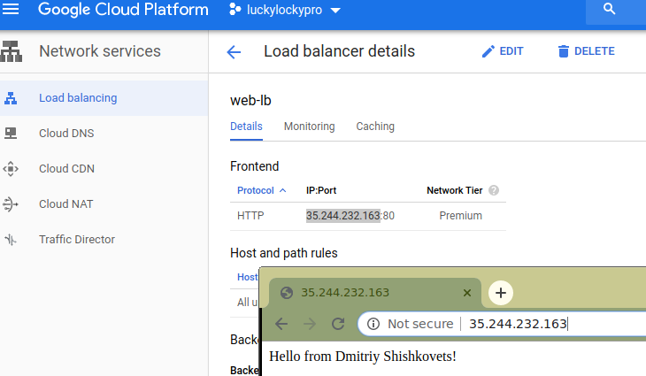   
