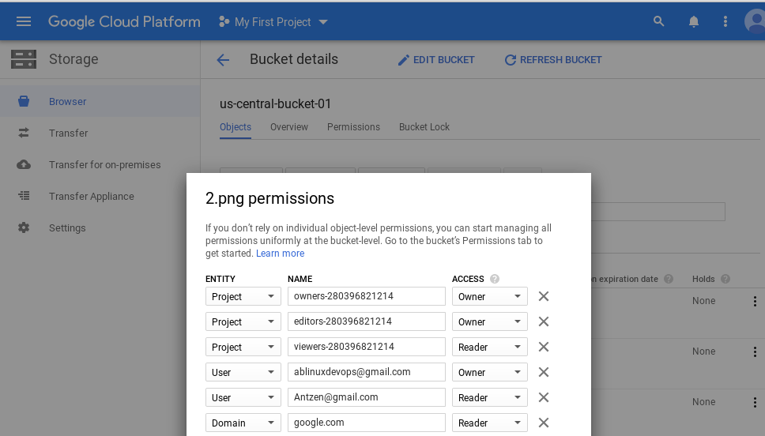

# google-cloud-module

<dl>
  <dt>Google Cloud Compute: CLOUD STORAGE </dt>

  <dd>Homework</dd>
</dl>

## Here's Andrei Batura GCP Homework 4 report:

1) Upload Objects to Cloud Storage :

2) GCS (Google Cloud Storage) Demo Lab :  
Use the Google Cloud Console UI and command line to interact with GCS (Google Cloud Storage). Utilize the transfer service to migrate data to your new storage buckets, configure ACL permissions on buckets and files, setup lifecycle management policies and setup GCS IAM permissions.
   
   
   
   
   
   
3) Task 3: Create and use buckets
* Set access control lists to restrict access
* Use your own encryption keys
* Implement version controls
* Use directory synchronization
* Share a bucket across projects using Cloud IAM
   
   
   
   
   
   
4) Task 4 : Create a CNAME record
   
   
   

5) Create network configuration via Terraform:
