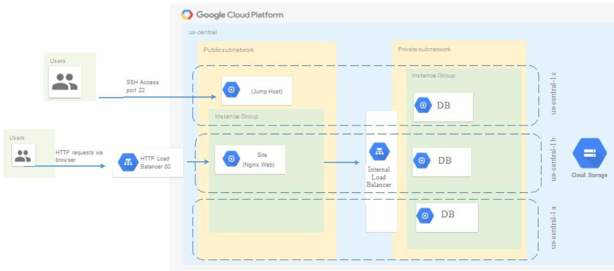
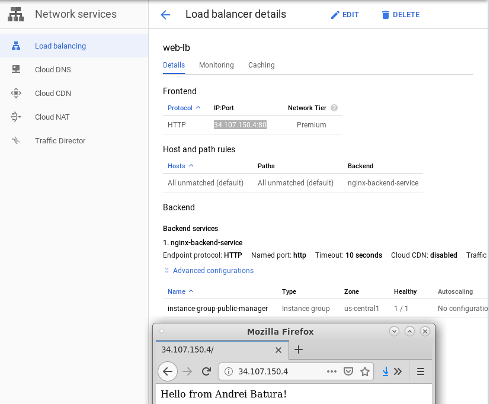
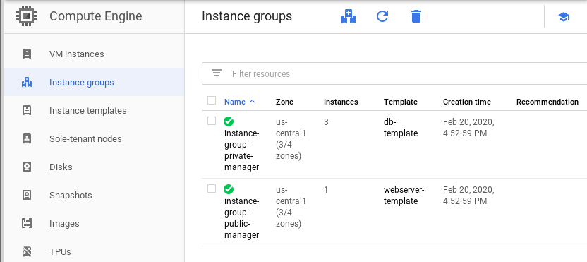
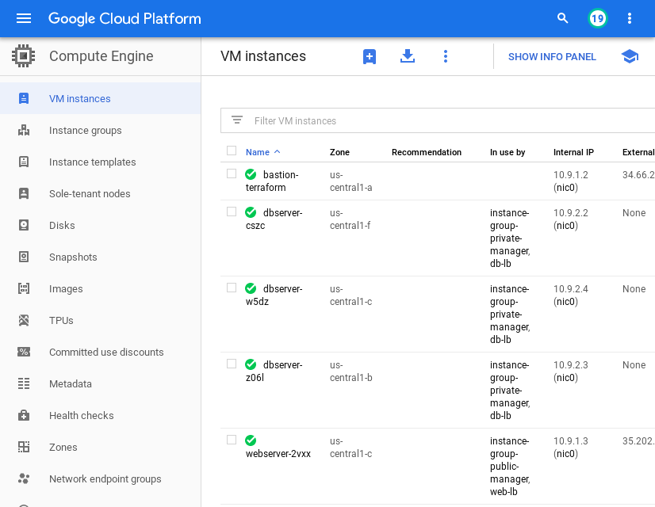
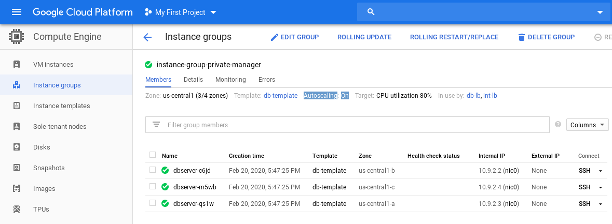
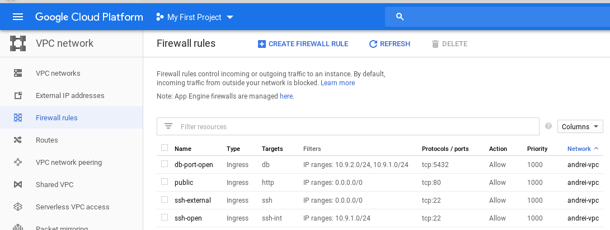
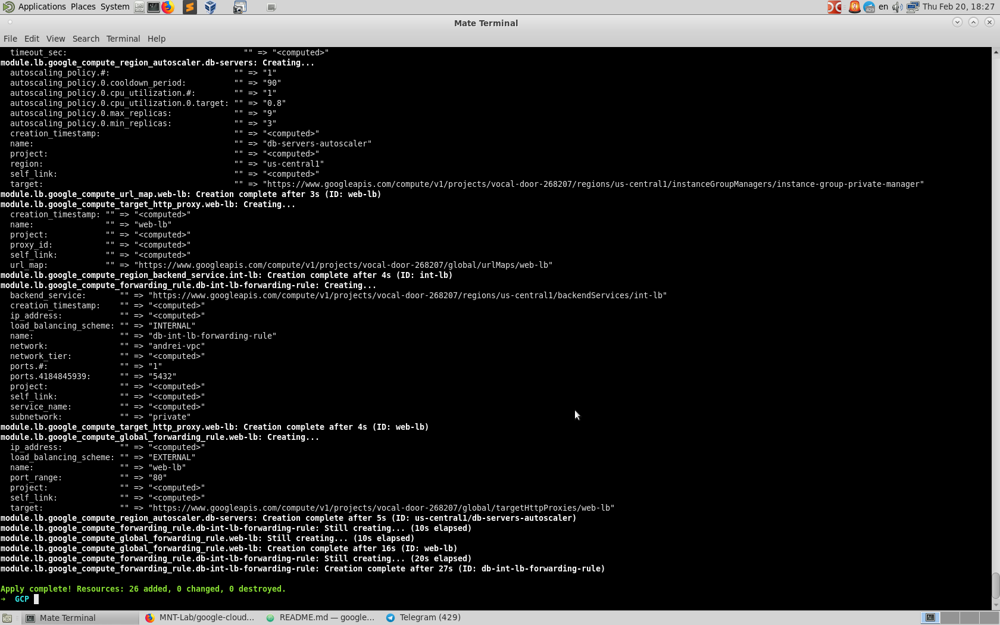

# google-cloud-module

<dl>
  <dt>Google Cloud Compute: Terraform </dt>

  <dd>Exit task</dd>
</dl>

## Here's Andrei Batura GCP Exit task report:

Create infrastructure configuration via Terraform:
   
   
   
   
   
   
   

Network configuration are taken from previous task and extended.
