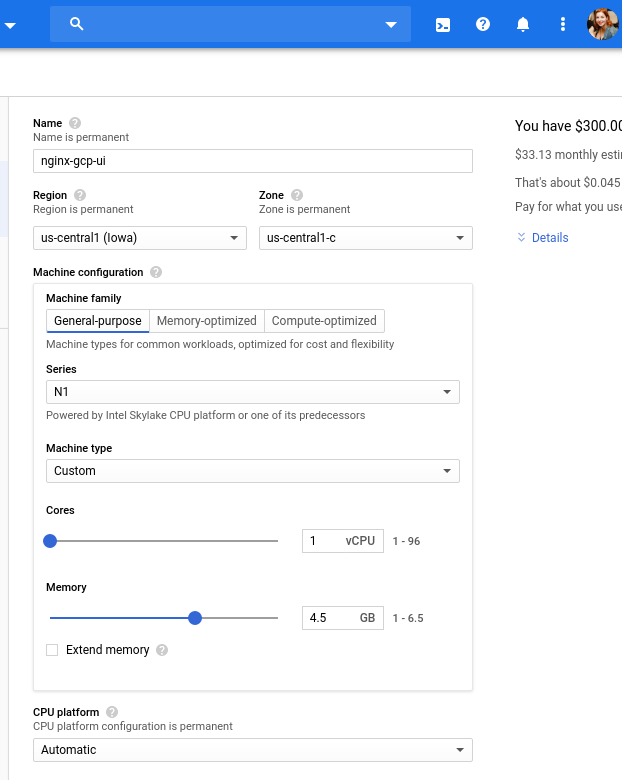
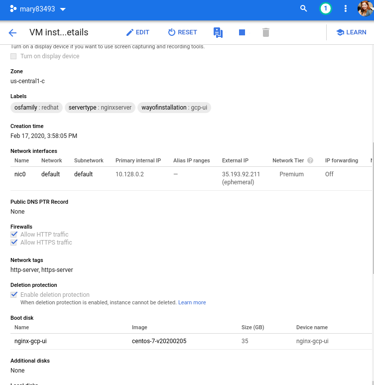
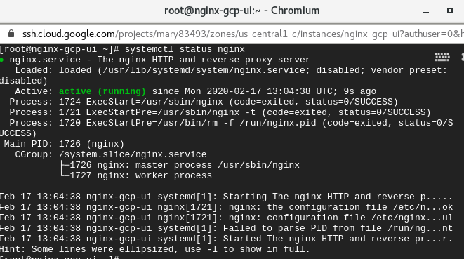
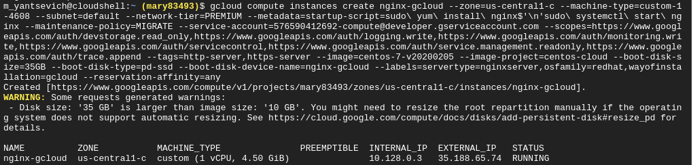
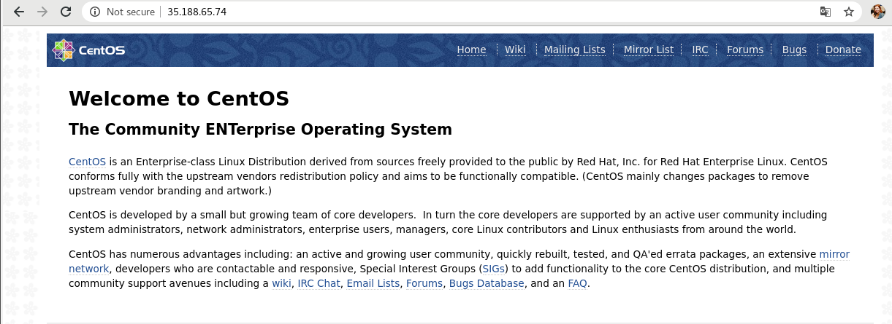
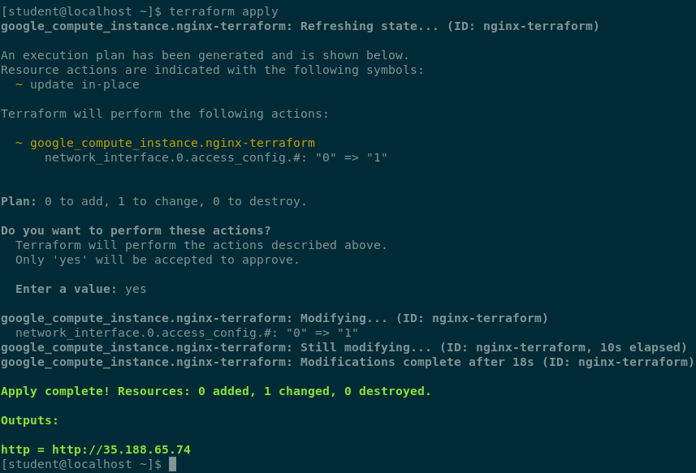
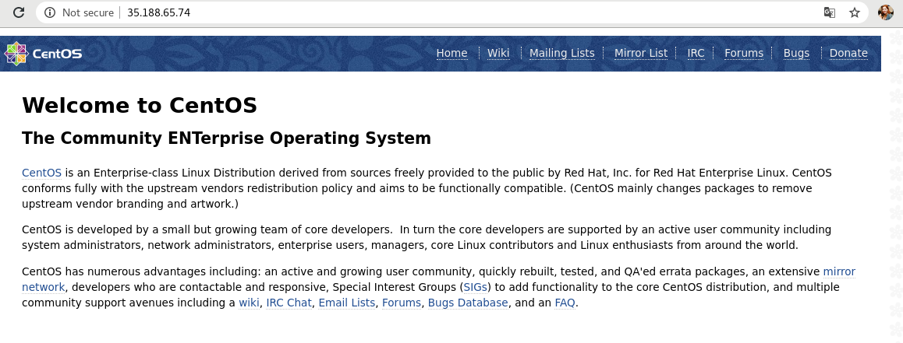
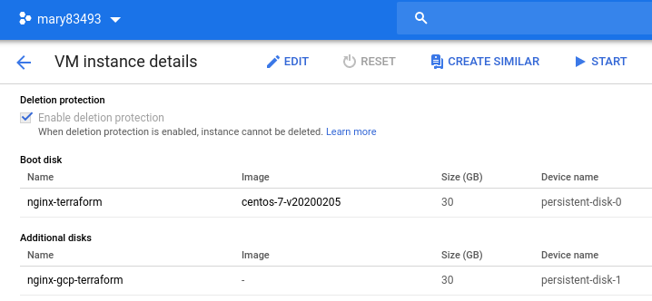

# google-cloud-module (Maryna Yantsevich' report)
## 1. Create Virtual Machine in Google cloud by the following ways:

### gcp-ui

  

  

  

### gcloud

  

  

### terraform

  

  

## 2. Create Persistent Disk and attach it to one of existing Virtual machine

  

