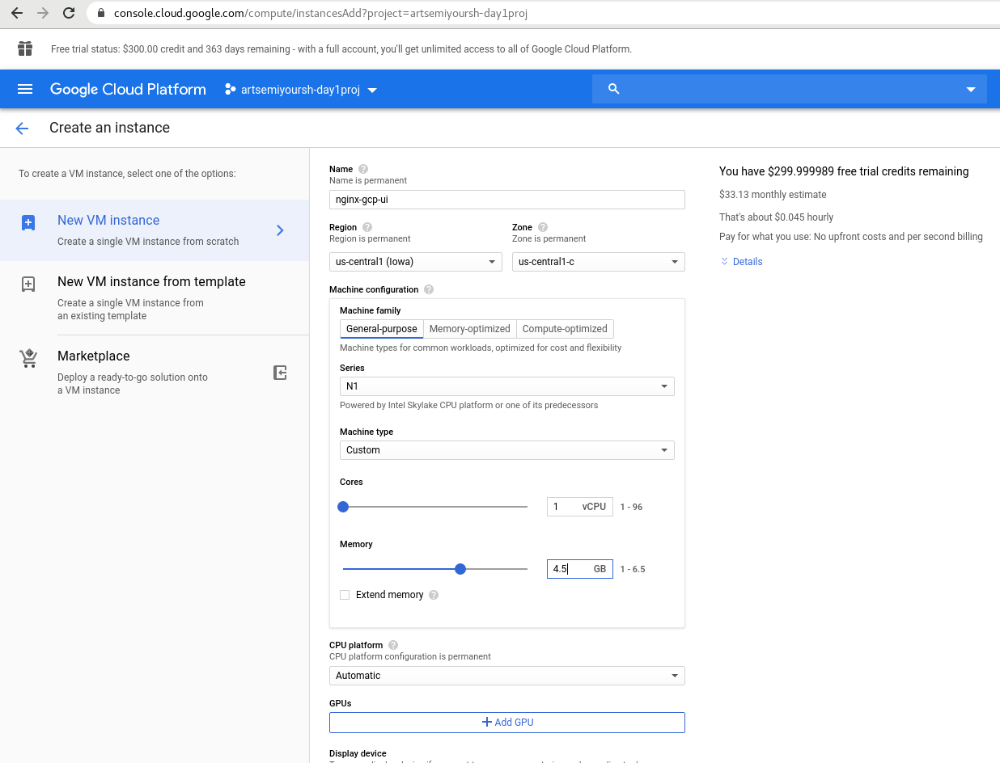
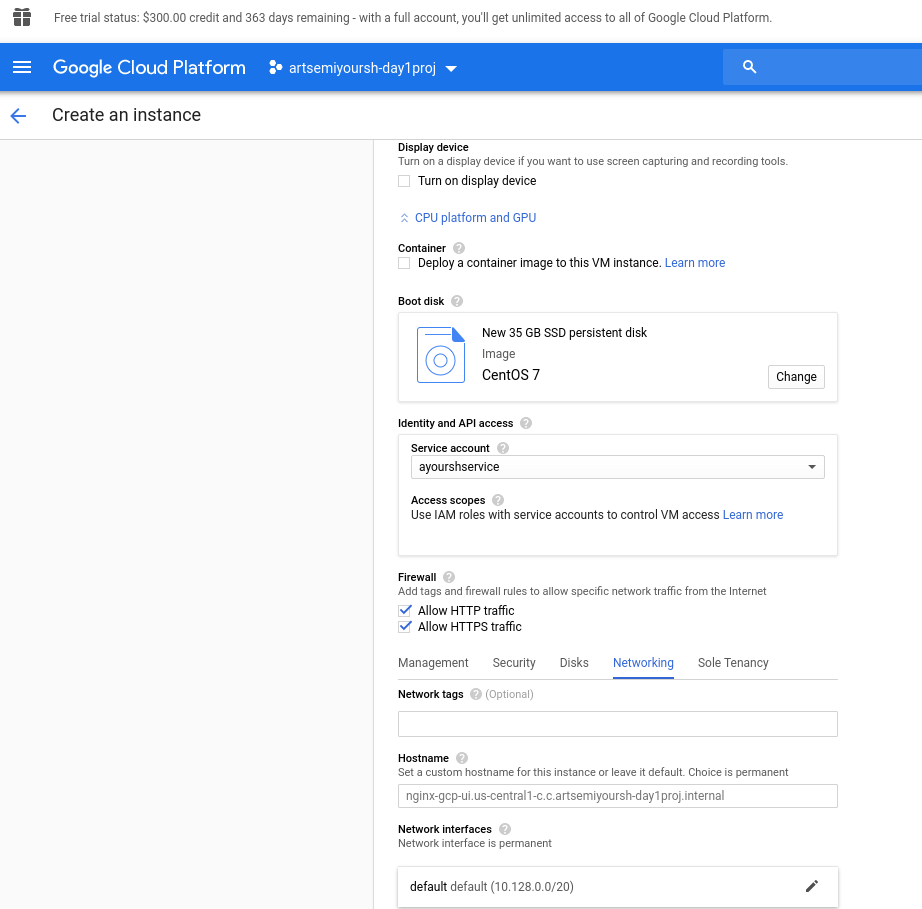
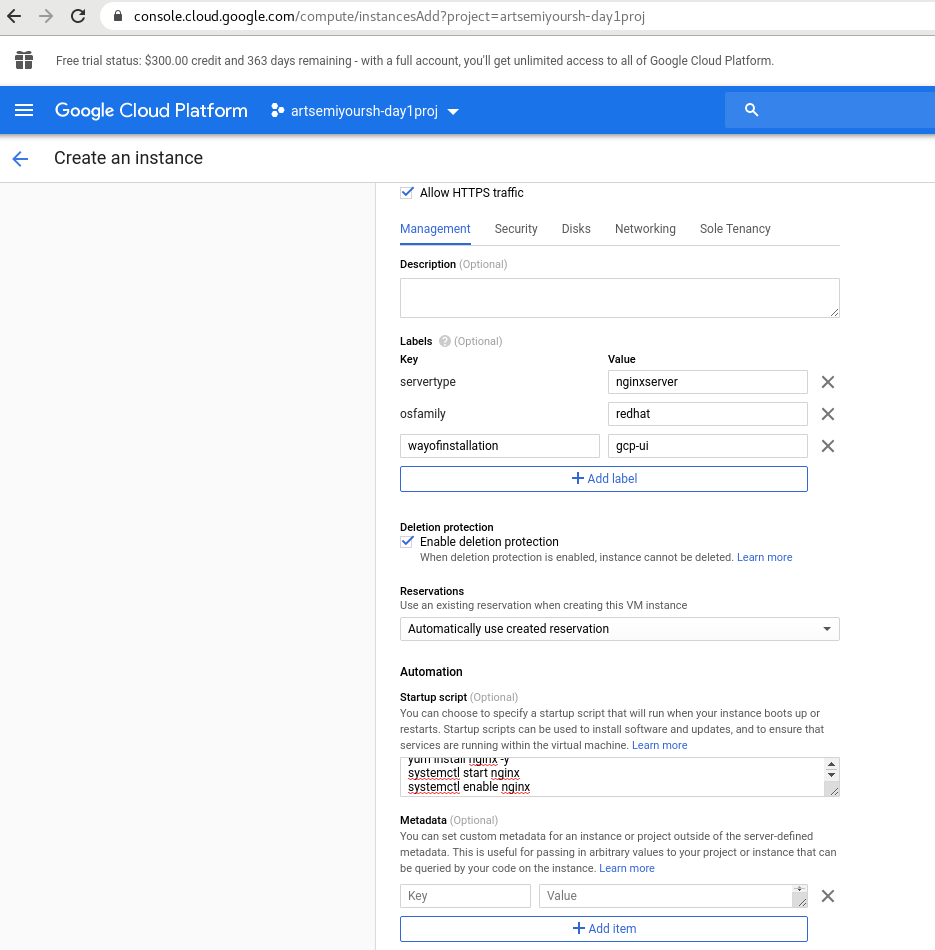
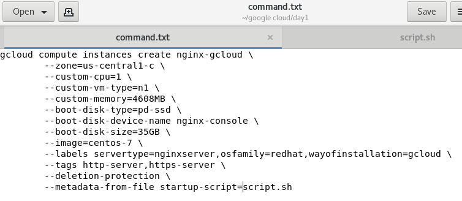
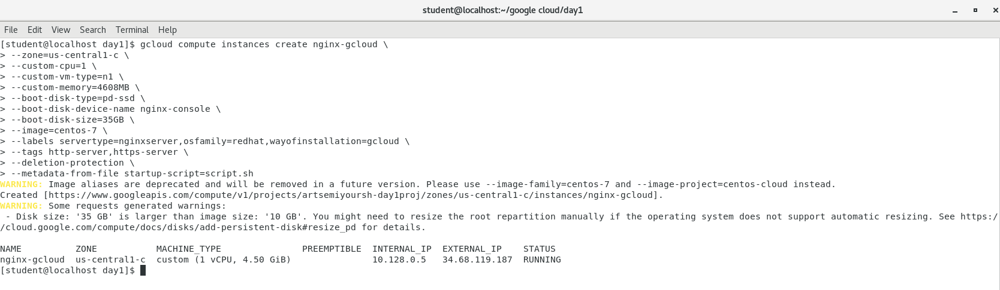
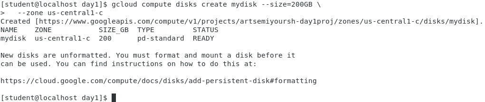
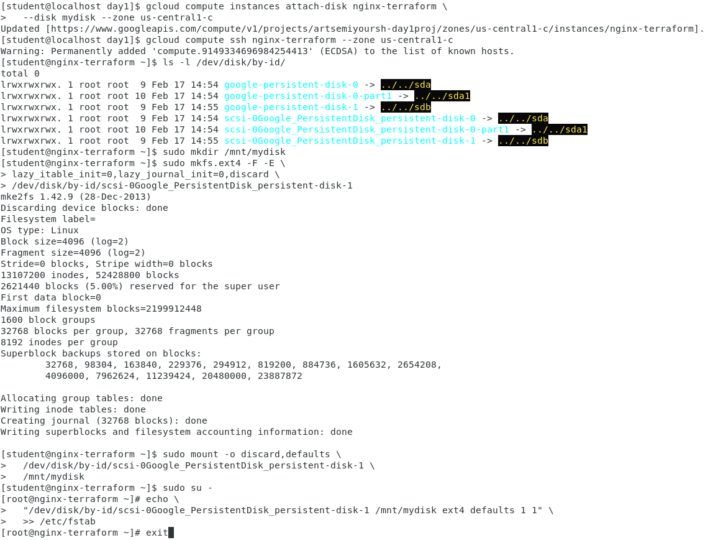
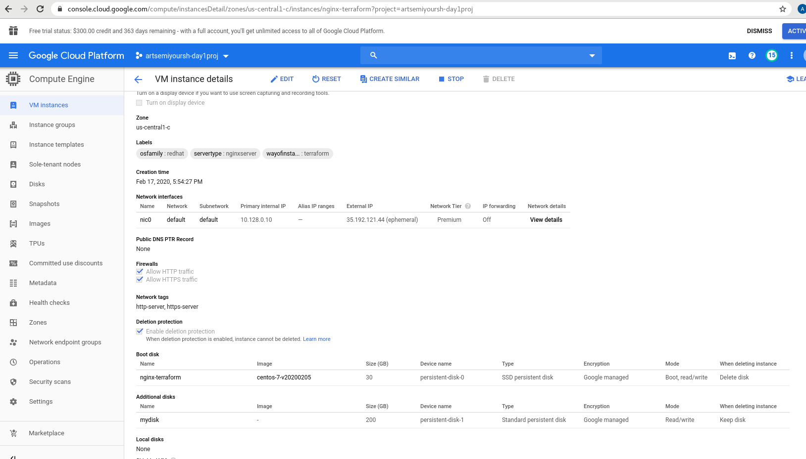
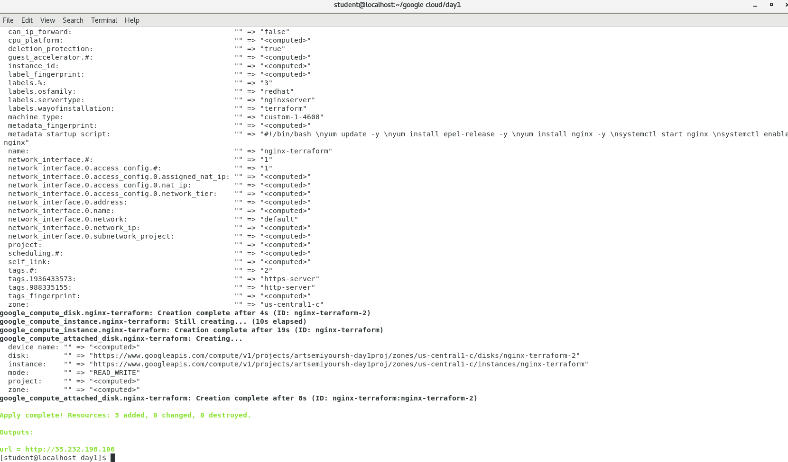

# google-cloud-module

#              1. Creating Virtual Machine in Google cloud by gcp-ui

#              2. Creating Virtual Machine in Google cloud by gcloud

#              3. Completing Lab goolge codelabs: persistent disk

#              4. Terraform output

