# gcp-cloud-module

## task 3 by Aliaksandr Skvarcheuski
###Task 1

### Setup Network and HTTP Load Balancers

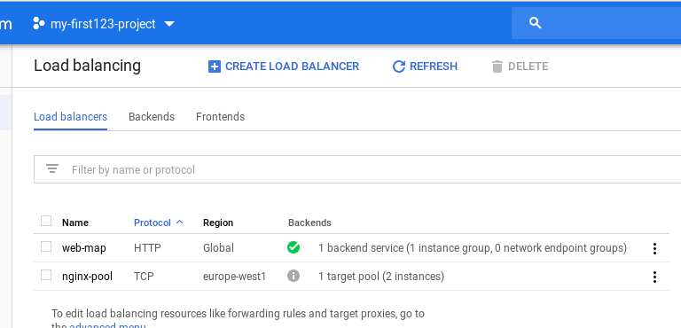
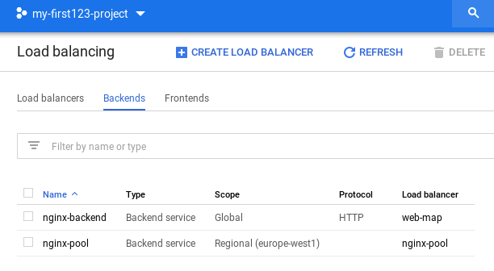
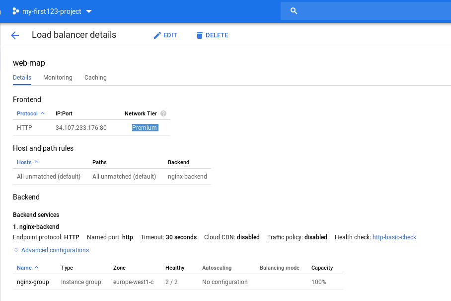
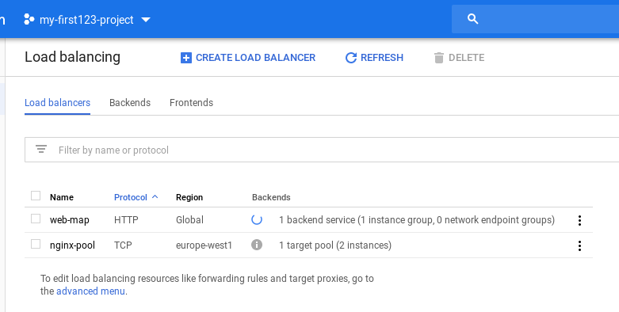

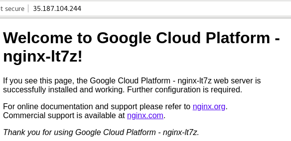
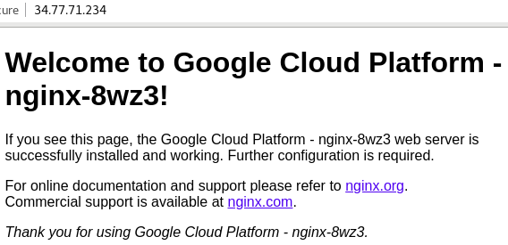

###Task 2
###Neworking 101

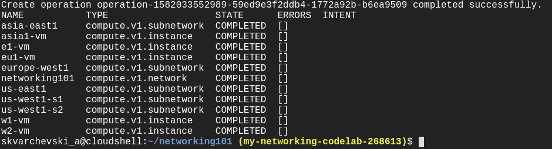
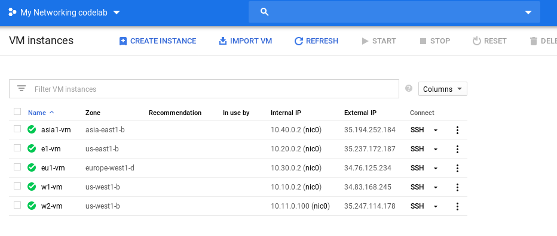
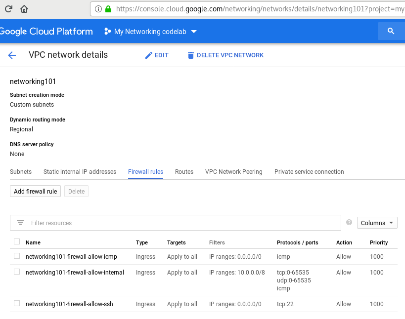
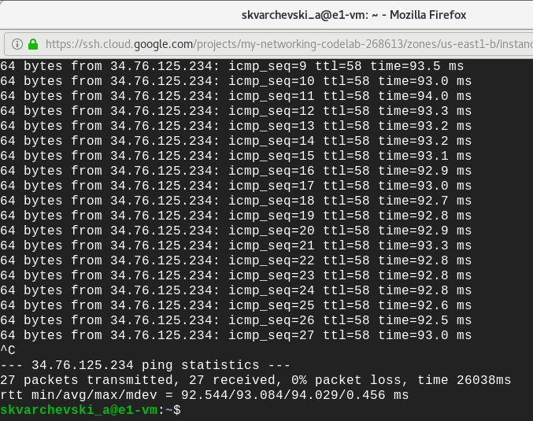
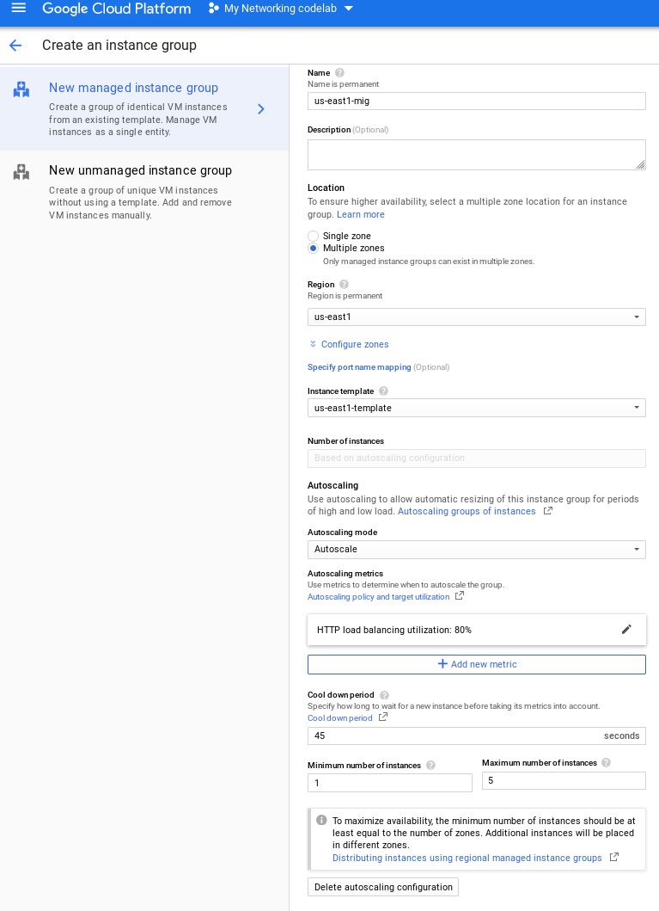
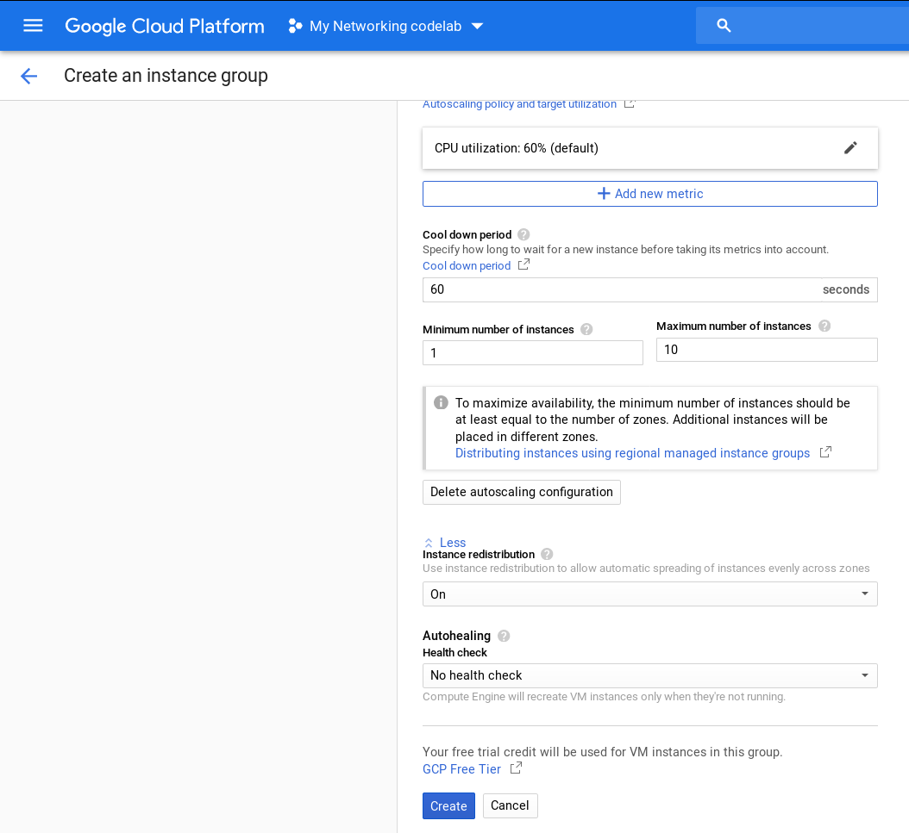
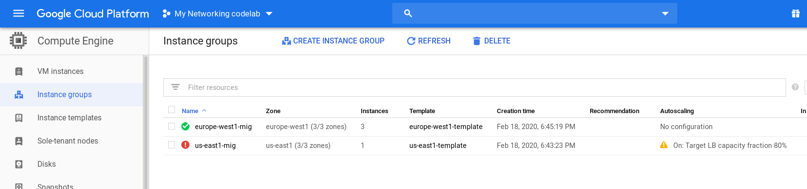
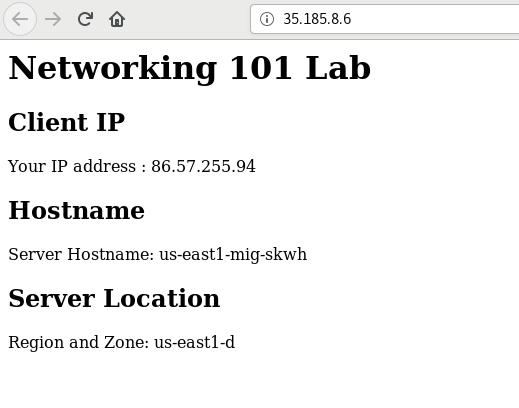
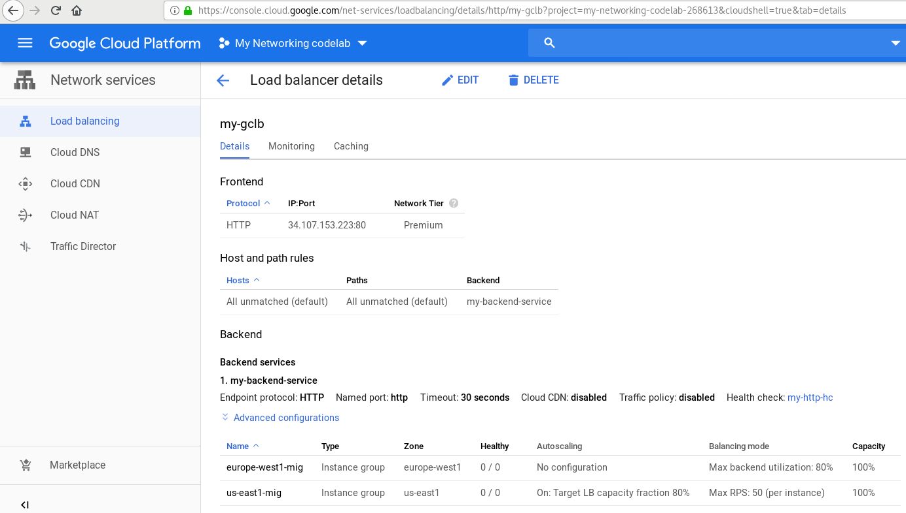
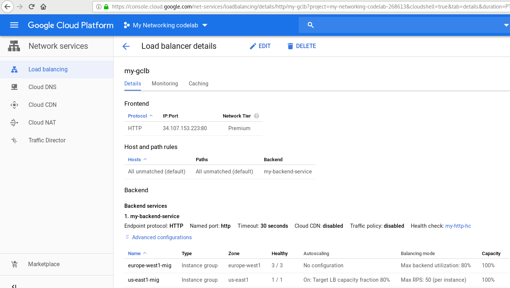
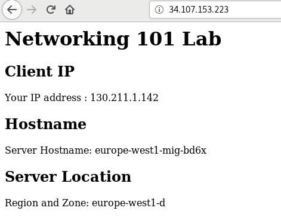
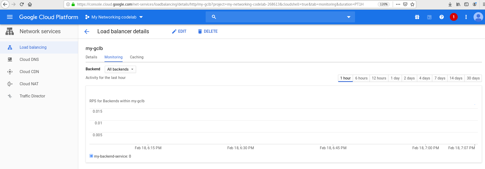
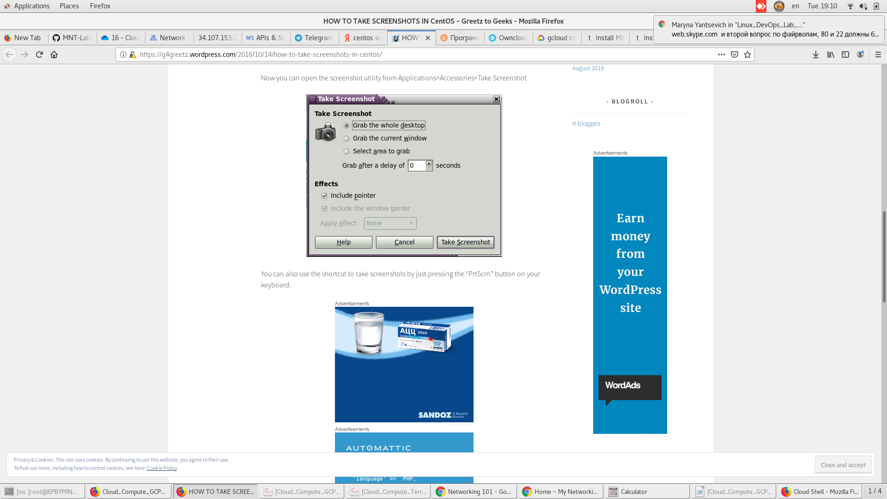
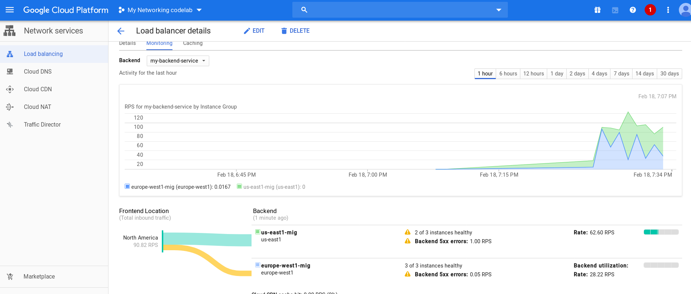
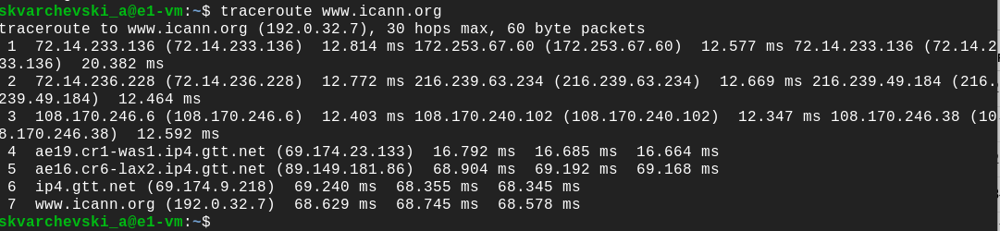
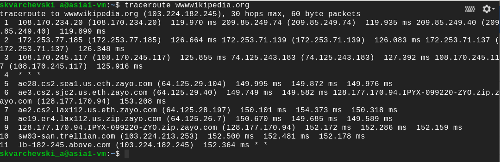
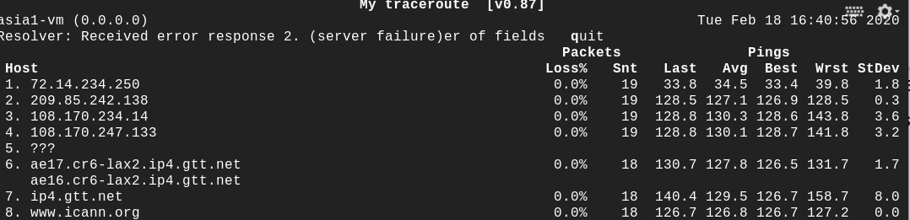

##TASK 5
#Create network configuration via terraform.
Resources should be used:
#1) google_compute_network (to create network)
Network name: ${student_name}-vpc
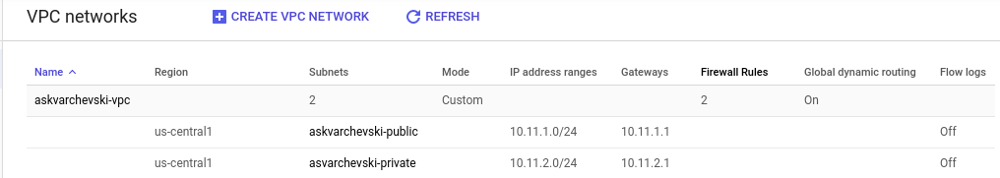
#2) google_compute_firewall
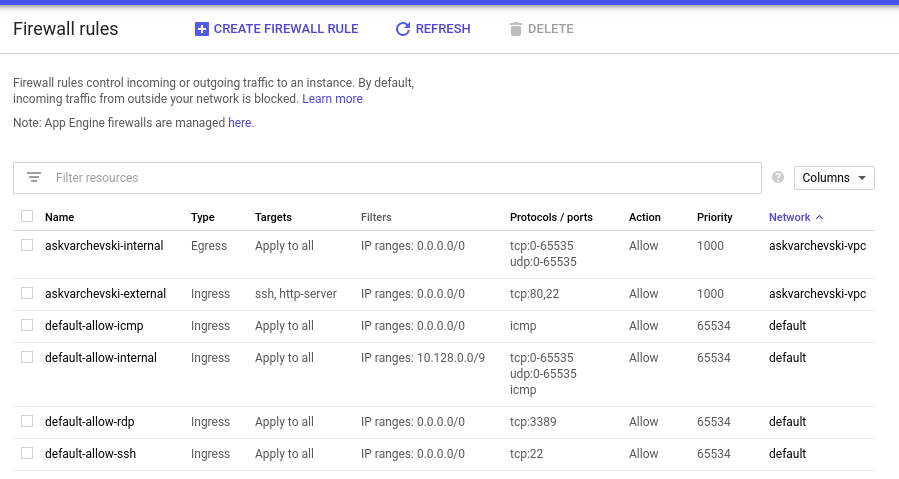
#3) google_compute_subnetwork
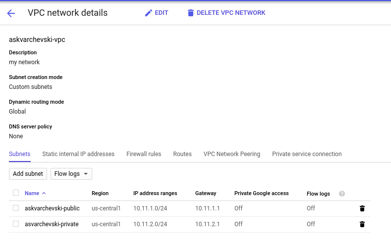
#4) google_compute_instance
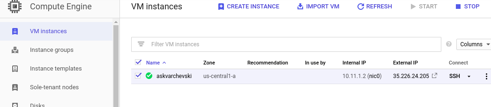
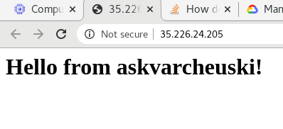
