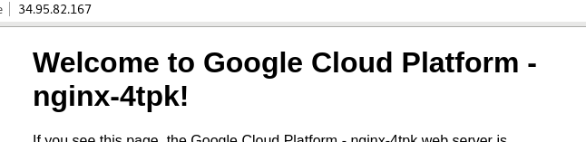
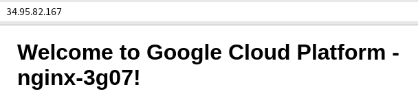
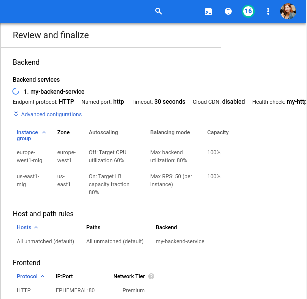
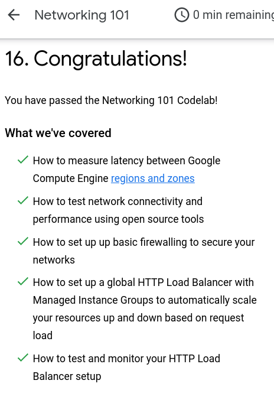
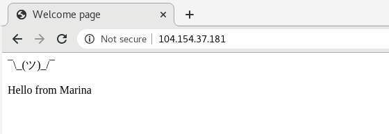

# google-cloud-module (Maryna Yantsevich' report)
## 1. Learn about two types of load balancers in Google Cloud Platform

  

  

  

## 2. Networking_101

  

  

  

## 3. Networking_102

  

## 5. Create network configuration via terraform

  

