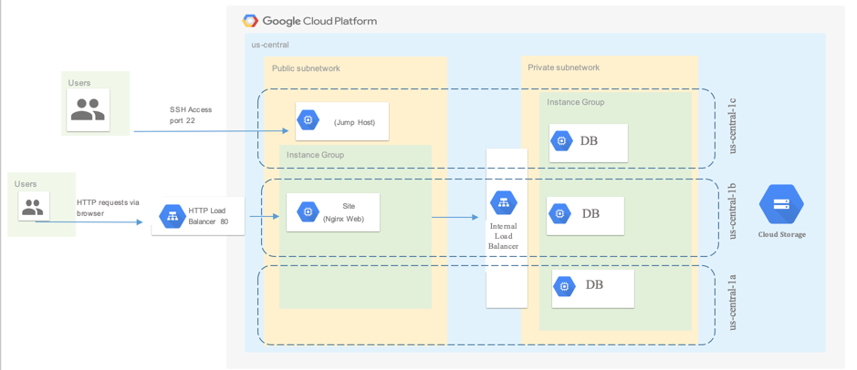
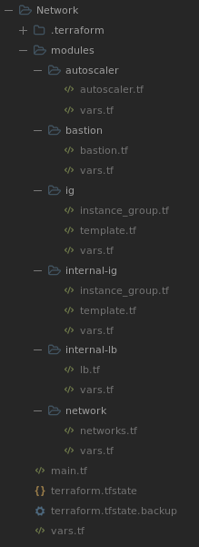
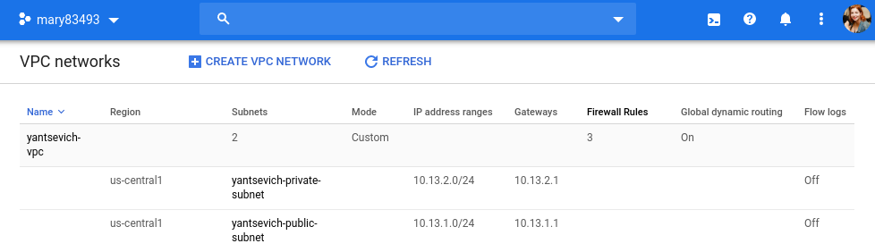
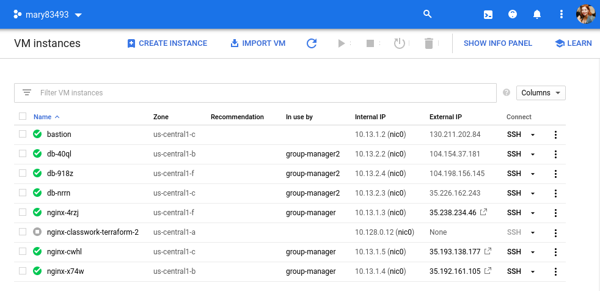
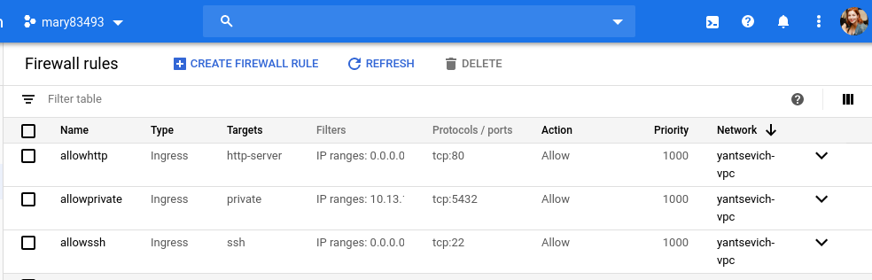
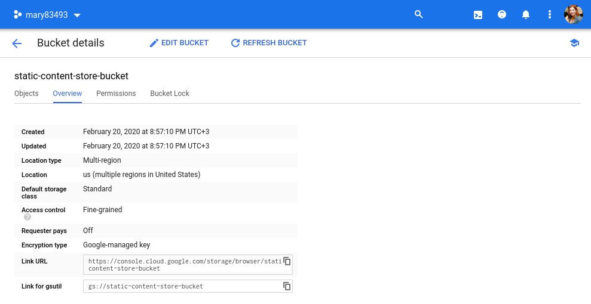
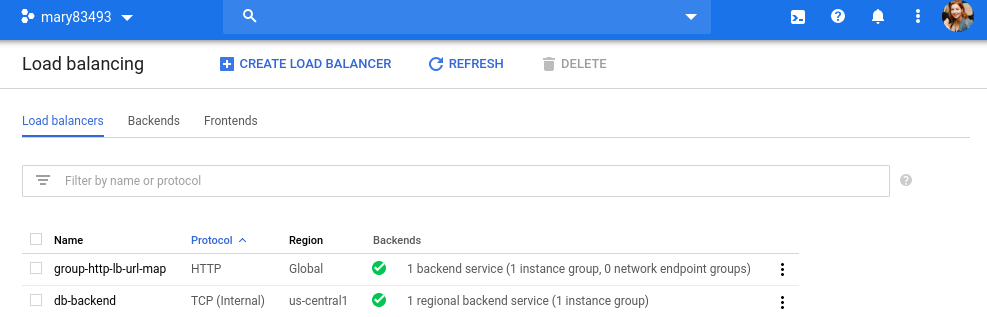
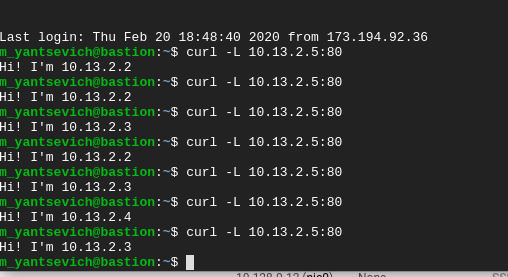

# google-cloud-module (Maryna Yantsevich' report)
## 1. Create the following configuration via terraform:

  

## 2. README.md✌
Bootstrap of this infrastructure should be started from main.tf.
Main.tf invokes 7 modules: 6 local and 1 GCE module:

  

- Module 'network' describes vpc, subnets and firewalls rules and passes values vpc, private/public subnet to output.
- Modules 'ig' and 'internal-ig' describe instance groups, templates and managers for 2 instance groups, which were used in this project. These modules have a group name and group manager as output.
- Module 'bastion' describe instance, which has inbound access to port 22 and outbound route to the private subnet. 
- Modules 'internal-lb' and external module 'gce-lb-http' describe 2 load balancers (HTTP and Network), which balance load 
- Module 'autoscaler' should be used with 'ig' module. This module describes rules of autoscaling for the first instance group

If something wasn't applied from bootstrap, please, repeat applying once again without destroing :)

## 3. A few screenshots

  

  

  

  

  

  

