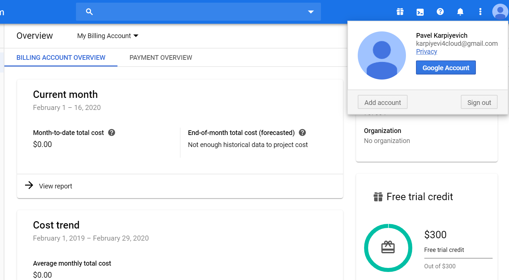
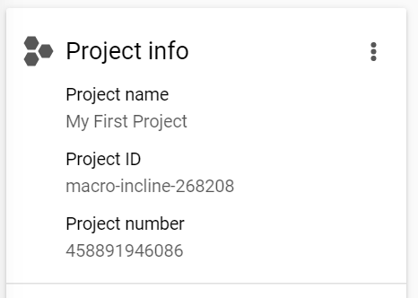
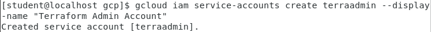
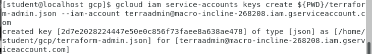
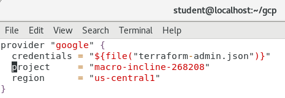
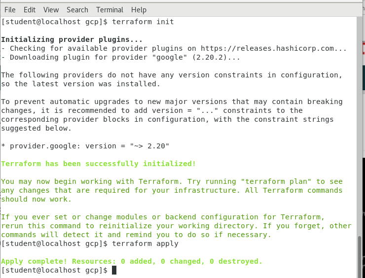

# google-cloud-module
Pavel_Karpiyevich_Report_1

1. Register own Google account
Done
2. Activate 12 months free tier

3. Perform Budget configuration
Done
4. Install and configure Google SDK
Done
5. Complete the lab “Cloud IAM”  https://codelabs.developers.google.com/codelabs/gcp-infra-cloud-iam/index.html?index=..%2F..cloud#0
Done
6. Create Service Account for Terraform

7. Configure terraform to access GCP via Service Account

