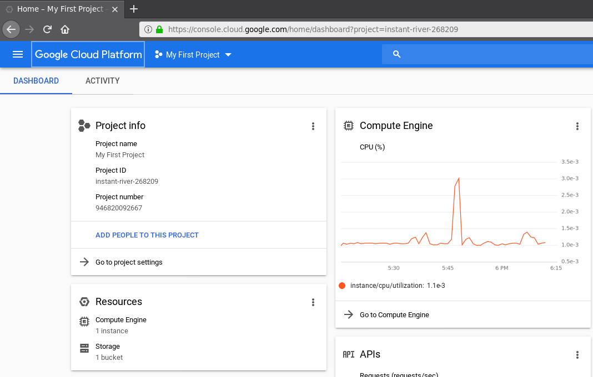
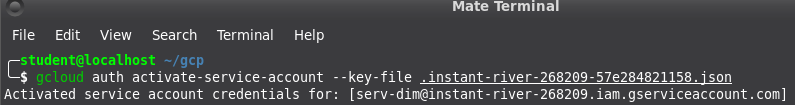
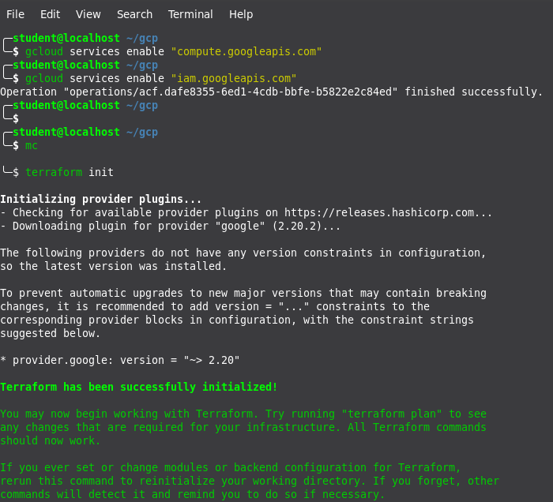
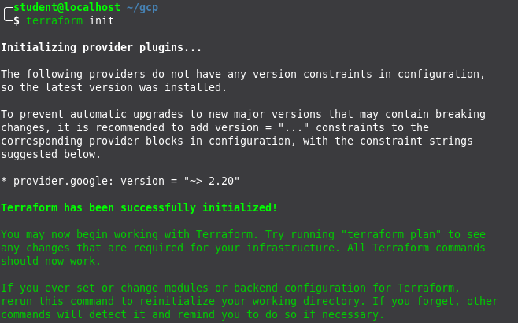

# google-cloud-module

1. Registered new Google account

2. Activated 12 months free tier account at GCP

3. Performed Budget configuration

4. Installed and configured Google SDK

5. Completed tutorial lab task at “Cloud IAM” https://codelabs.developers.google.com/codelabs/gcp-infra-cloud-iam/index.html?index=..%2F..cloud#0

6. Created Service Account for Terraform

7. Configured terraform to access GCP via Service Account

