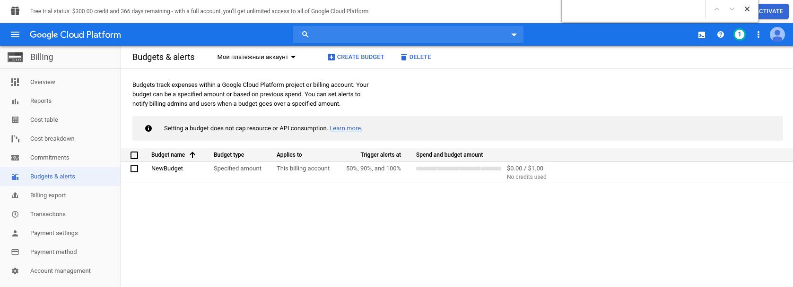
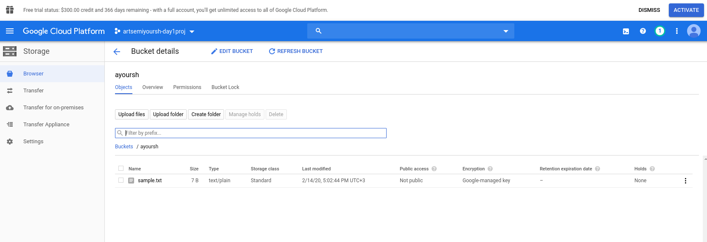
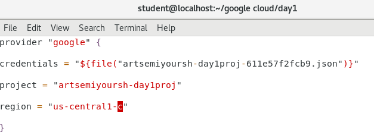

# google-cloud-module

#              1. Register own Google account

#              2. Activate 12 months free tier

#              3. Perform Budget configuration

#              4. Install and configure Google SDK

#              5. Complete the lab “Cloud IAM”

#              6. Create Service Account for Terraform

#              7. Configure terraform to access GCP via Service Account.

