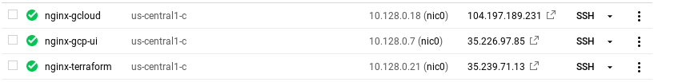
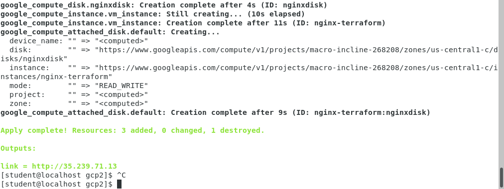
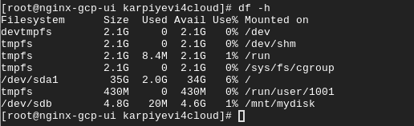
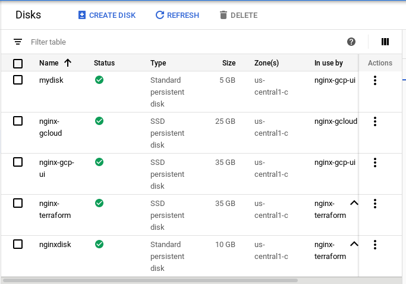

# google-cloud-module
Pavel_Karpiyevich_Report_2
Task 1
It’s aiming to gain knowledge about the mechanisms of VMs creation in Google Cloud.
Create Virtual Machine in Google cloud by the following ways:
gcp-ui (complete Lab: google codelabs: VM creation)
gcloud
terraform (all settings should be provided via variables (tfvars), add URL (“http://IP. Address/” to output )

Task 2
It’s aiming to gain knowledge about the mechanisms of Persistent disk creation in Google Cloud.
Create Persistent Disk and attach it to one of existing Virtual machine (nginx-gcp-ui).
1. Complete Lab goolge codelabs: persistent disk with using your VM name

2. Create terraform configuration to do the same via terraform (use VM: nginx-gcp-terraform).

[Terraform files folder](https://github.com/MNT-Lab/google-cloud-module/tree/pkarpiyevich/day2/src2)

