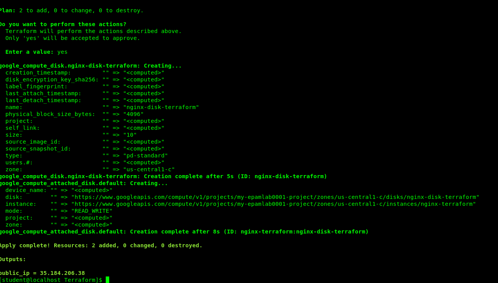

# google-cloud-module

#               Create Virtual Machine in Google cloud by the following ways:
#               1. gcp-ui (complete Lab: google codelabs: VM creation)

#              2. gcloud

#              3. terraform (all settings should be provided via variables (tfvars) )

#              4. Create Persistent Disk and attach it to one of existing Virtual machine (nginx-gcp-ui).

#              5. Create terraform configuration to do the same via terraform (use VM: nginx-gcp-terraform).

