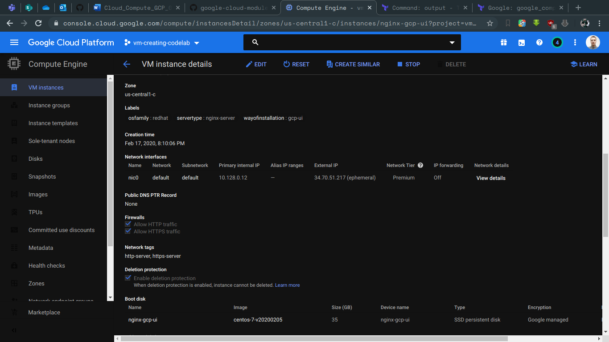
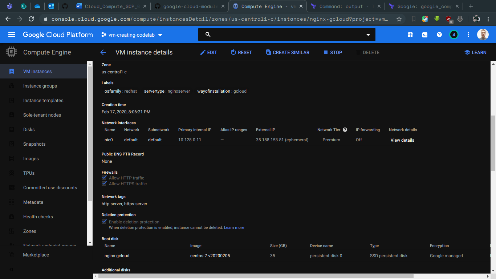
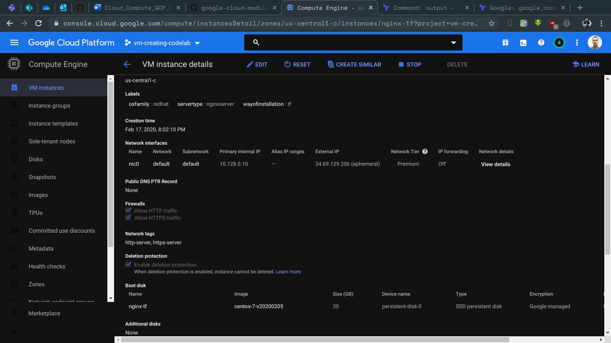
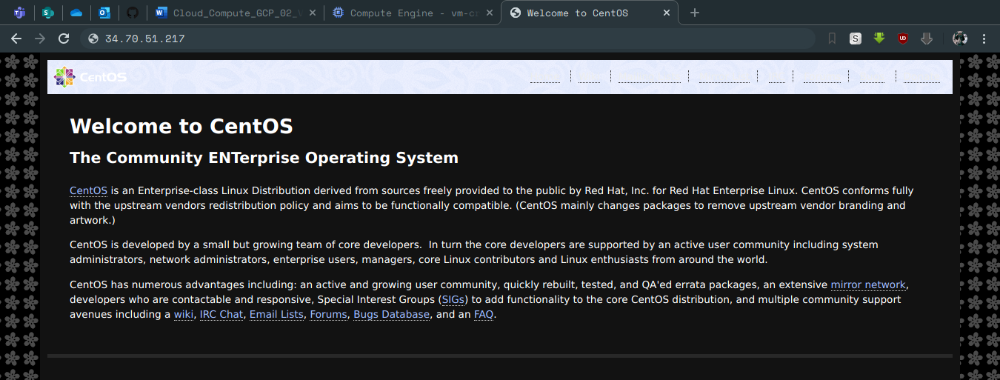
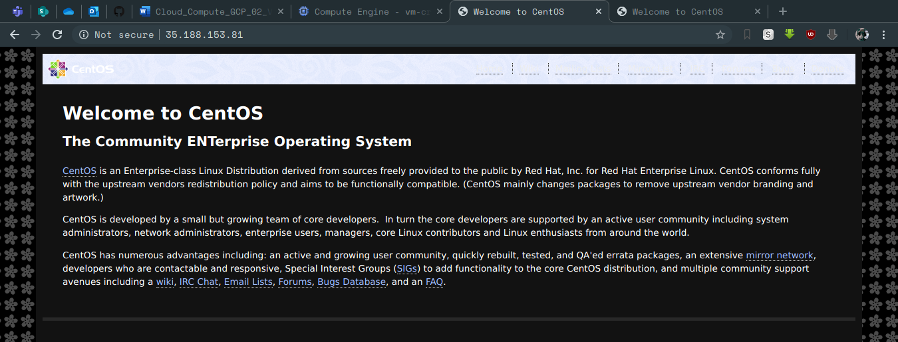
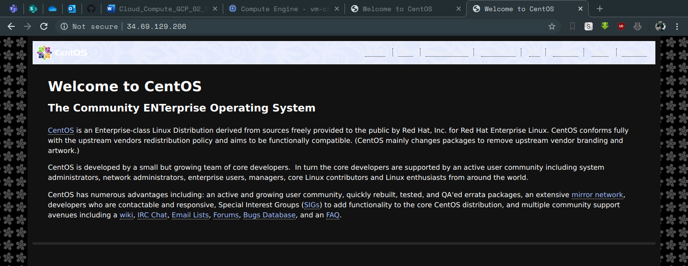
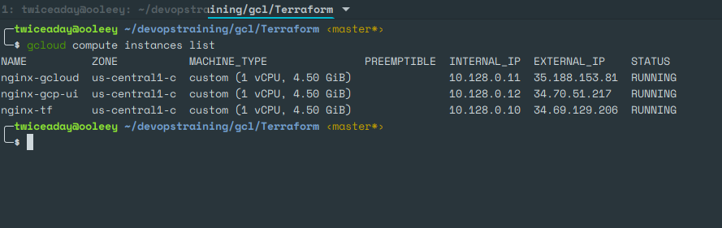
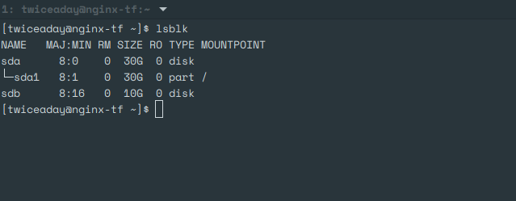

# google-cloud-module - Siarhei Kazak
# Day-3

## Today I've done the following:

## Created and pre-configured VM with a network solution:

### Network name:  skazak-vpc
### Firewall rules for external (allow 80,22) and internal (allow 0-65535) access 
### Subnets with ranges: 10.8.1.0/24 10.8.2.0/24
### nginx with default page “Hello from Siarhei Kazak”

## Attaching a few screenshots

### VMs created with 3 different ways:

### VMs provisioned with nginx:

### List of running instances:

### Additional drive for nginx-tf instance:

