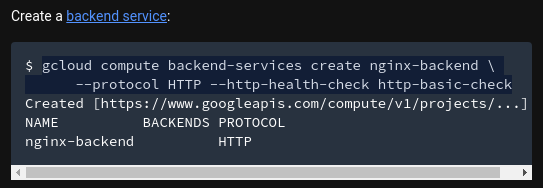

# google-cloud-module - Siarhei Kazak
# Day-3

# Today I've done the following:
## Completed lab:: https://codelabs.developers.google.com/codelabs/cloud-load-balancers/index.html?index=..%2F..index#0
## Completed lab:: https://codelabs.developers.google.com/codelabs/cloud-networking-101/index.html?index=..%2F..index#0

### Network name:  skazak-vpc
### Firewall rules for external (allow 80,22) and internal (allow 0-65535) access 
### Subnets with ranges: 10.8.1.0/24 10.8.2.0/24
### nginx with default page “Hello from Siarhei Kazak”

## Attaching a few screenshots

## Task1: 
### Facing some troubles in:

### The output is:

### Anyway got it done by choosing another region for LB

## Task2:
### Siege attack on LB:

### LB graph: actually seems to be okay with it :)

## Task5
### Custon nginx page:

### Firewall rules:

### Subnets:

