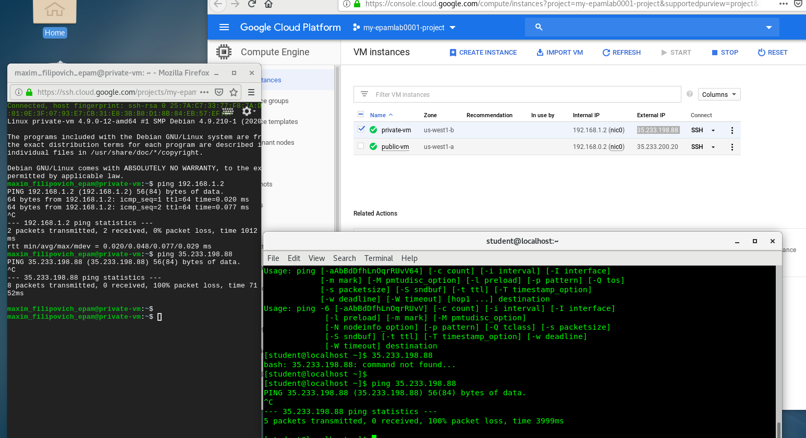

# google-cloud-module

#               1. Task 1

#              2. Task 2

#              3. Task 3

Not clear do we need activate option or not to finalize this lab

#              4. Task 4

#              5. Task 5

