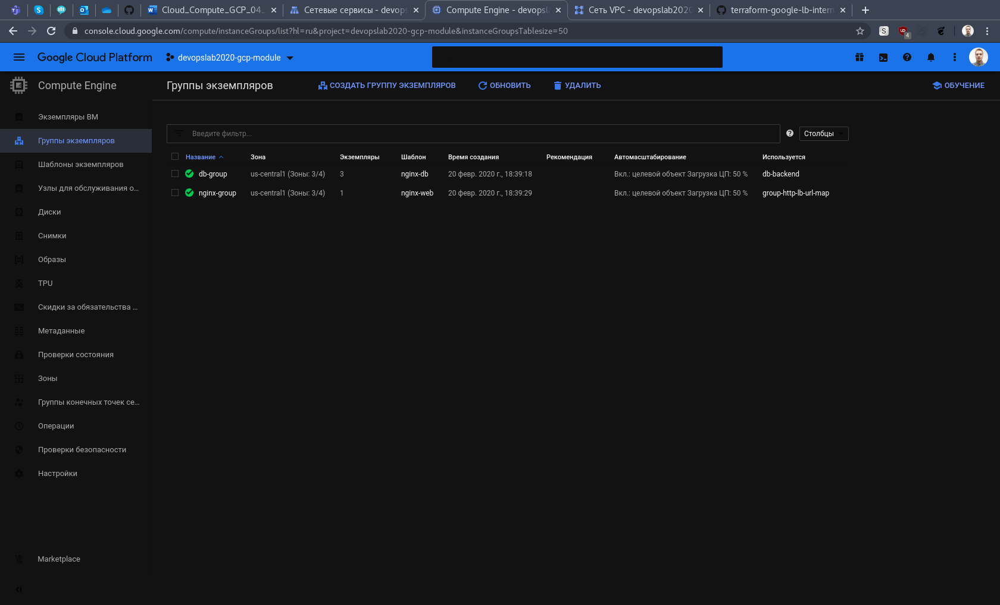

# google-cloud-module - Siarhei Kazak
# Day-3 Final Terraform Task

# I've finally done the following:

## Created infrastructure with following tophology (+autoscaling):

## Attaching a few screenshots

### Instance Temlates:

### VM Instances:

### Instance Groups:

### DB Instance Group:

### VPC Network:

### Firewall rules:

### Load Balancers:

### Internal Load Balancer (check from bastion VM):

### Static IPs:

