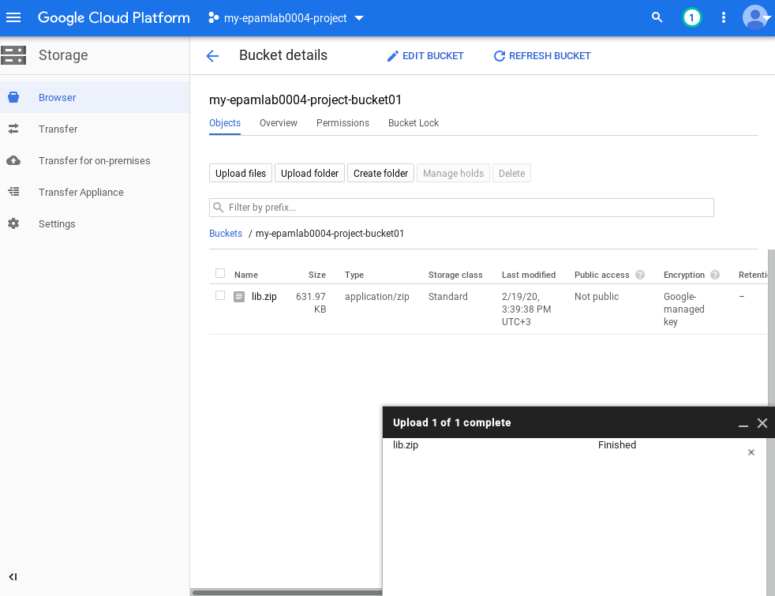
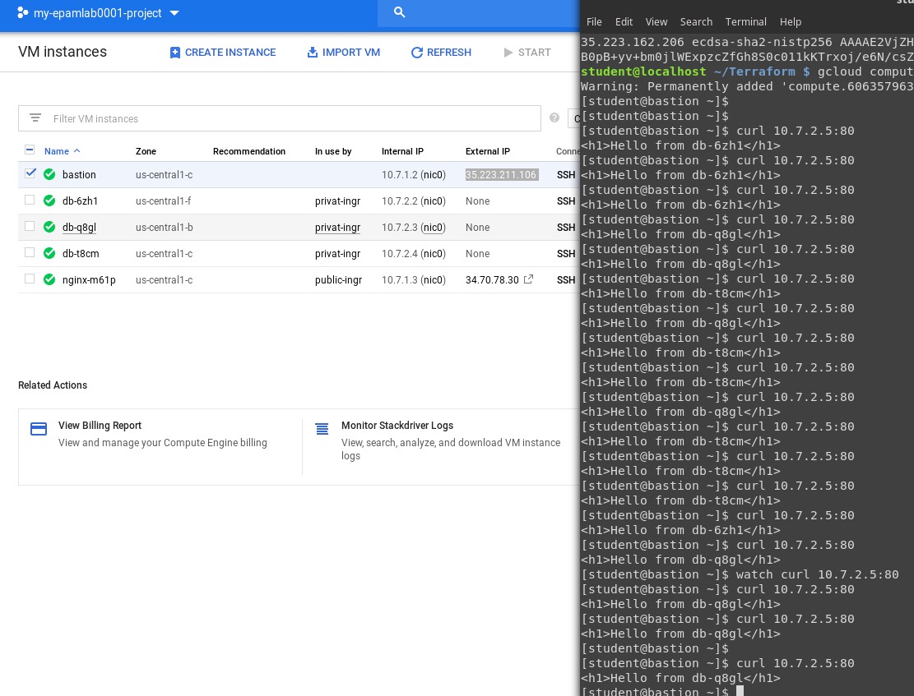
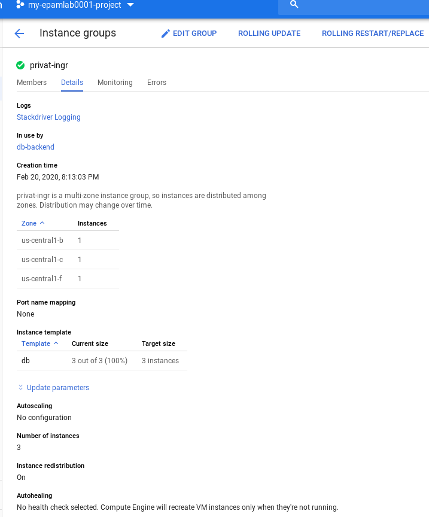
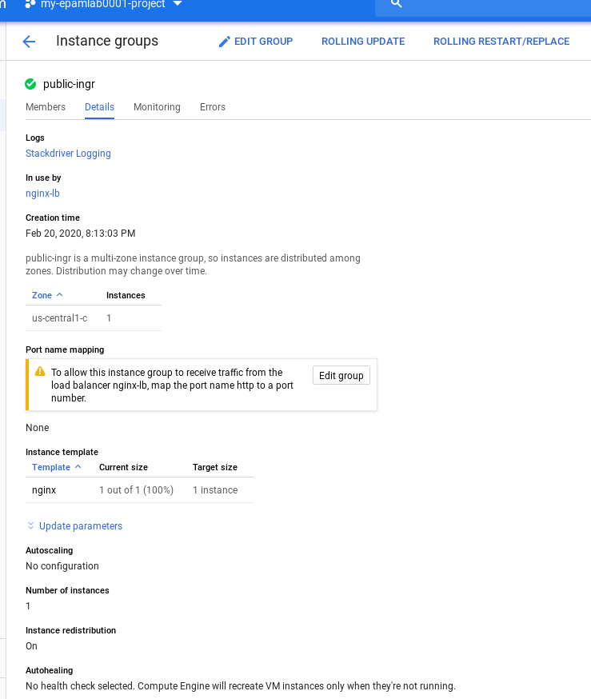
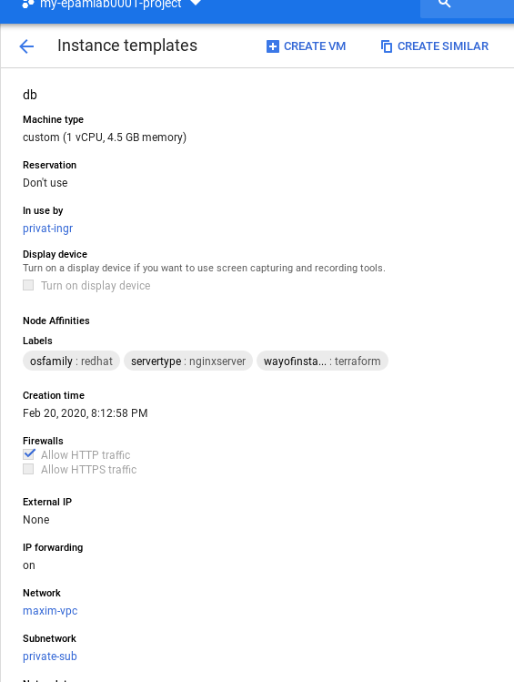
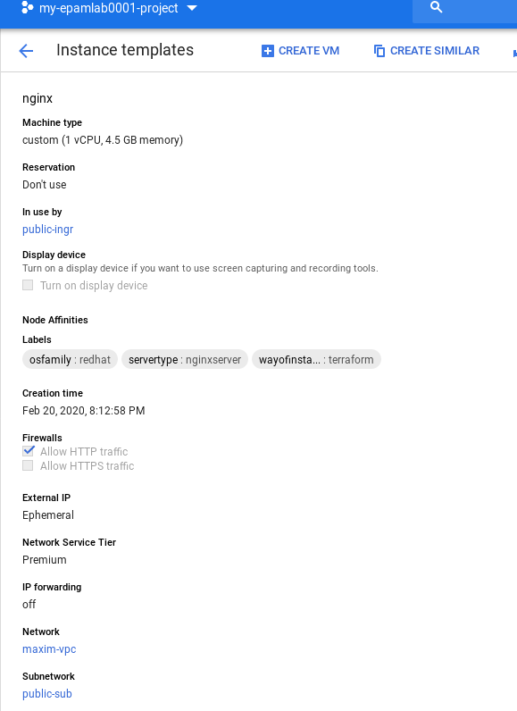
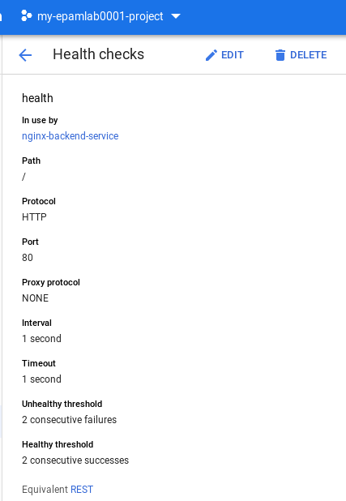
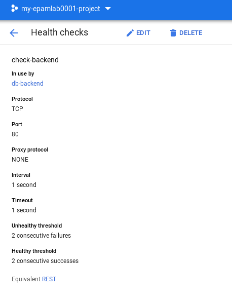

# google-cloud-module

#               Create Virtual Machine in Google cloud by the following ways:
#               1. 

#              2. 

done

#              3. 

done

#              4. .

done

#              5. 

