# google-cloud-module

#              1. Doing codelabs: cloud-upload-objects-to-cloud-storage lab

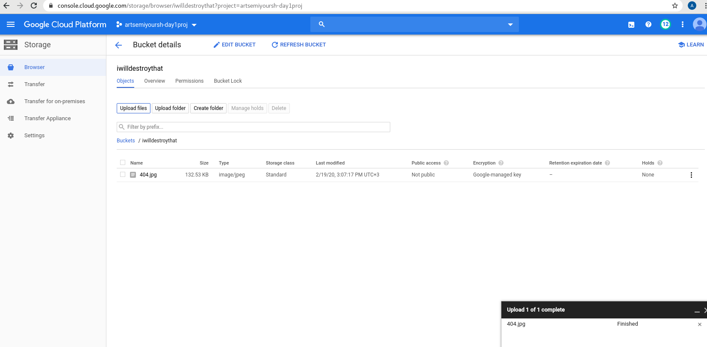

#              2. Doing codelabs: cloud-storage lab

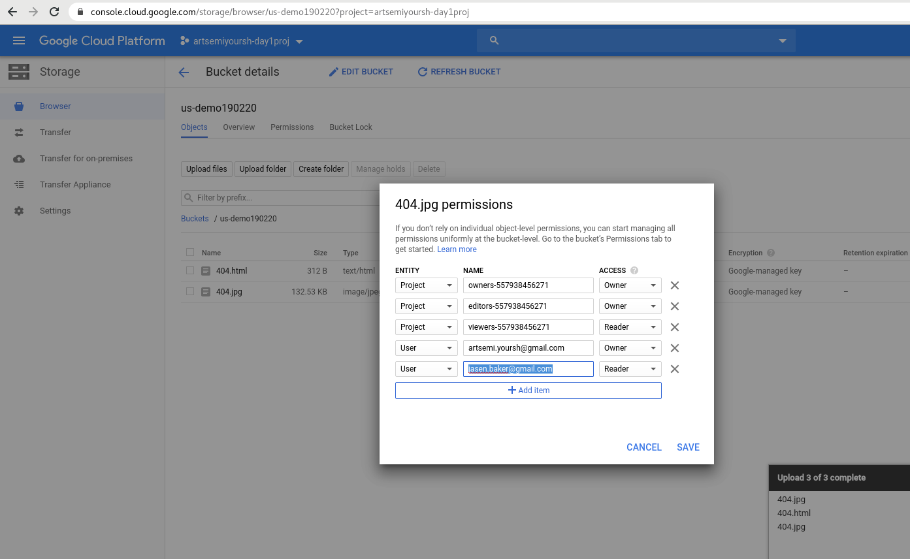
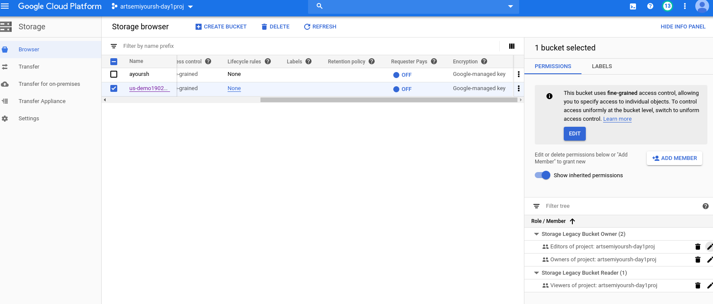
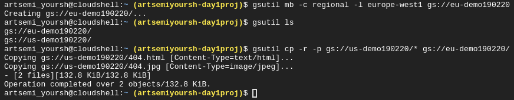
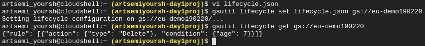
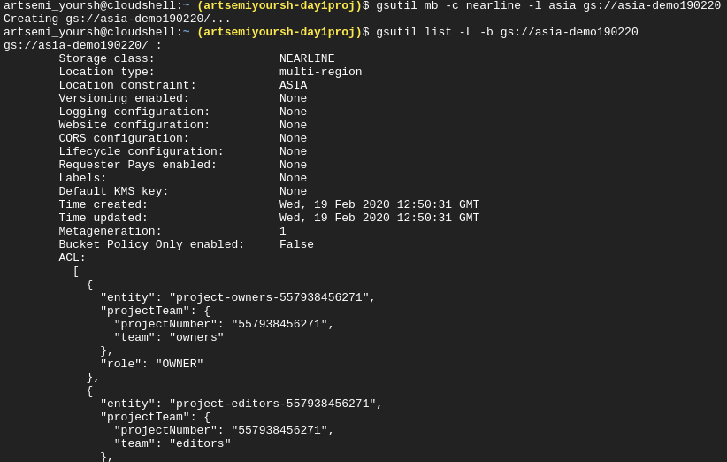
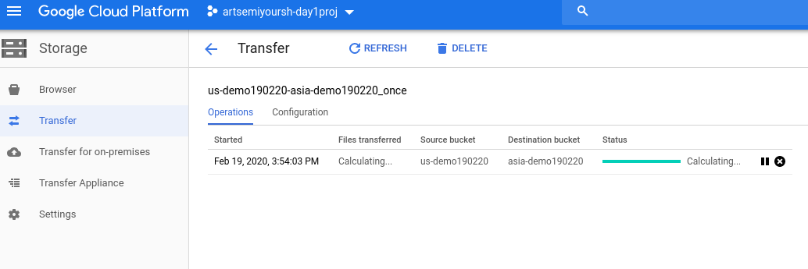
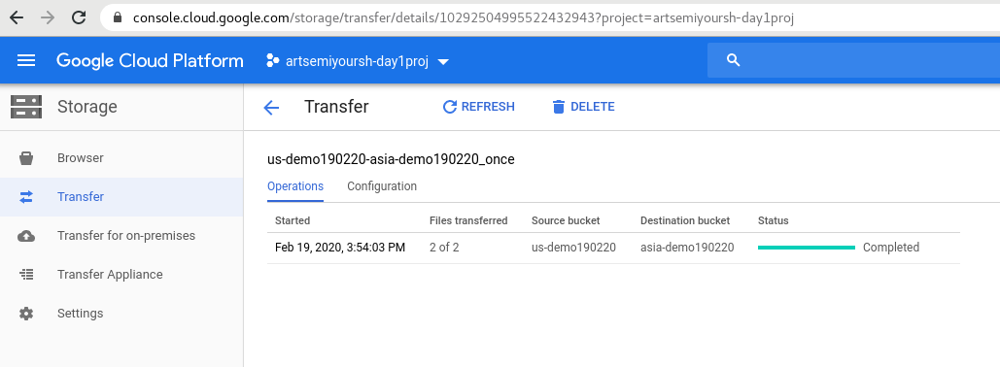
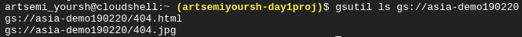
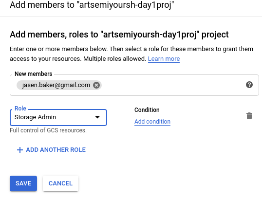

#              3. Doing codelabs: gcp-infra-cloud-storage lab

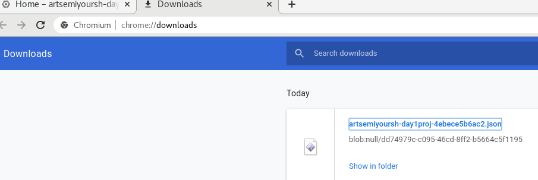
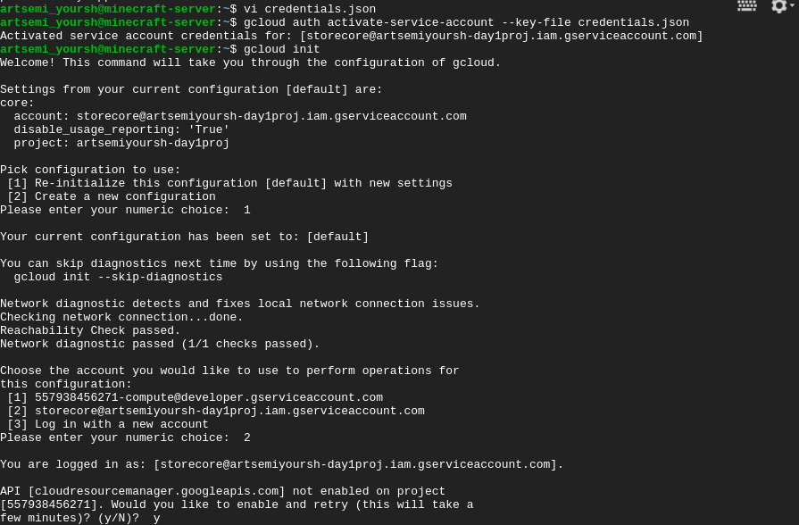
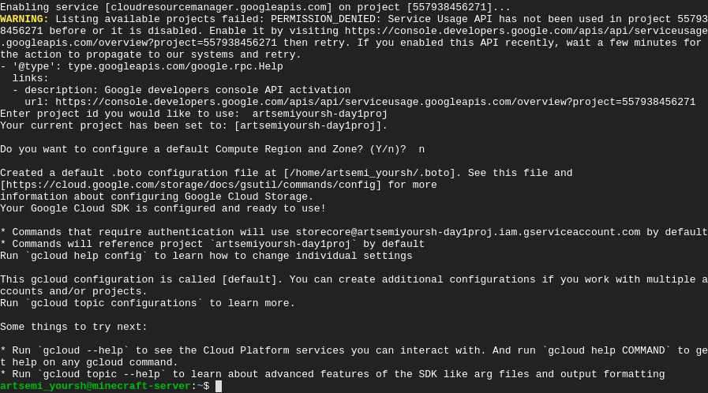
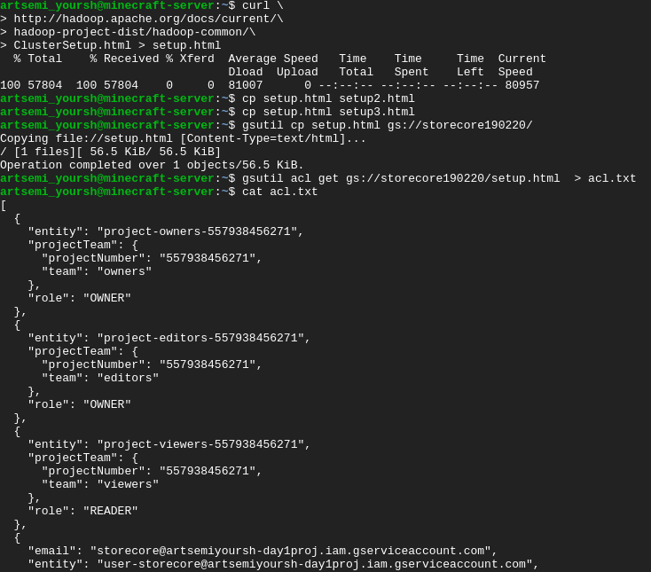
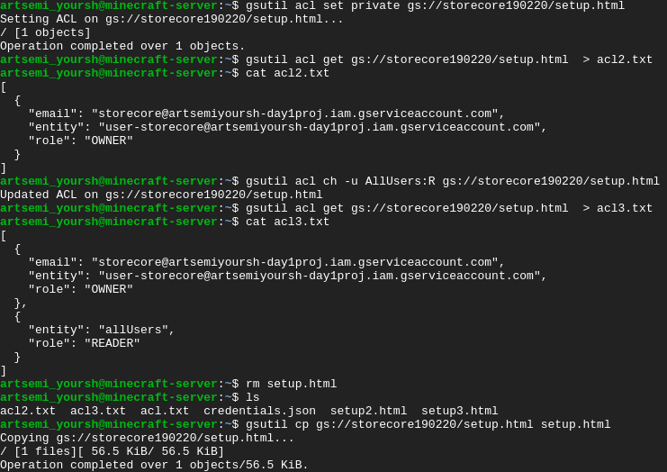
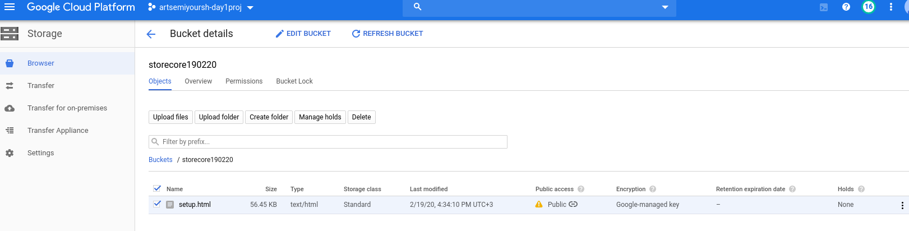
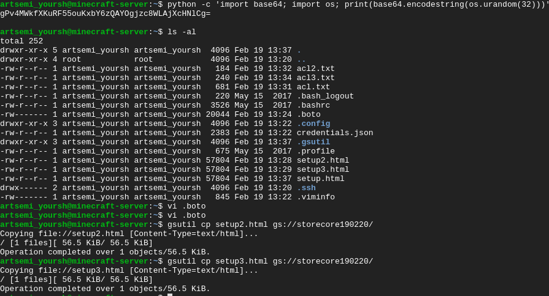
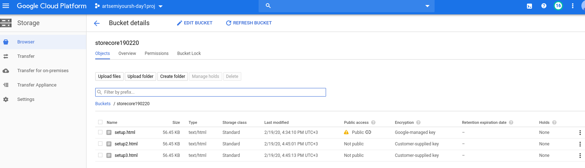
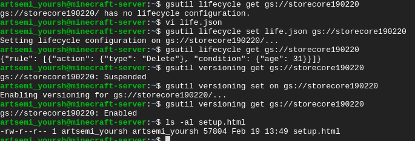
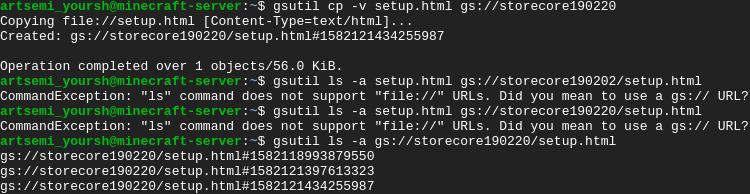
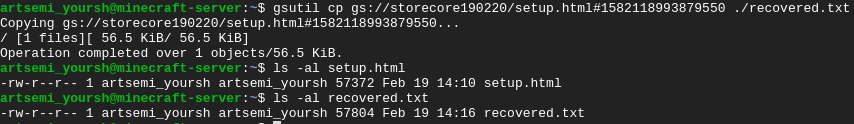
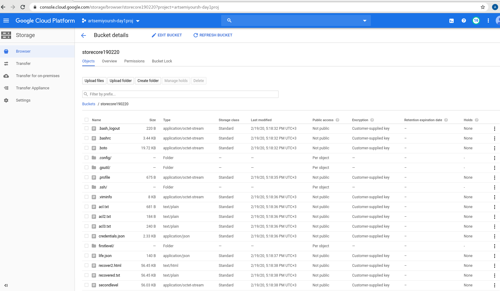
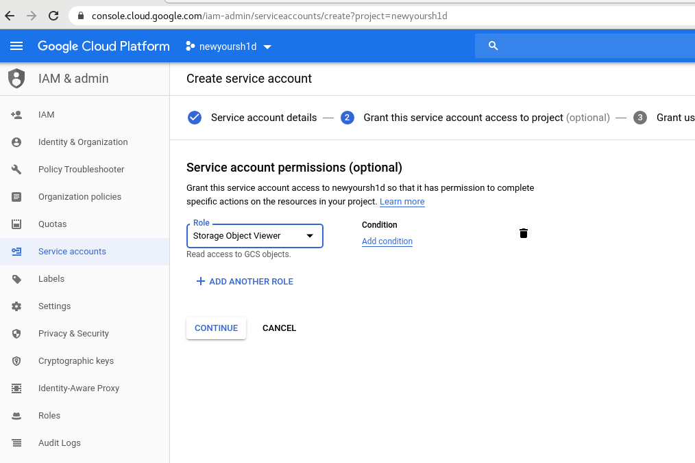
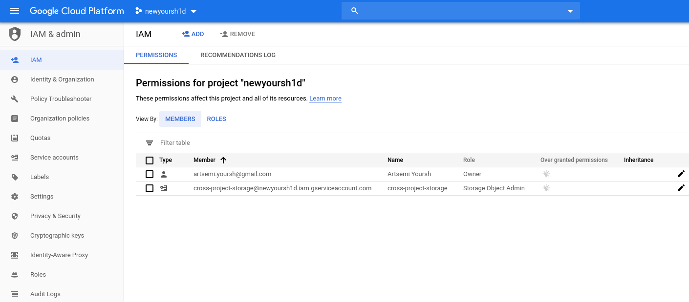
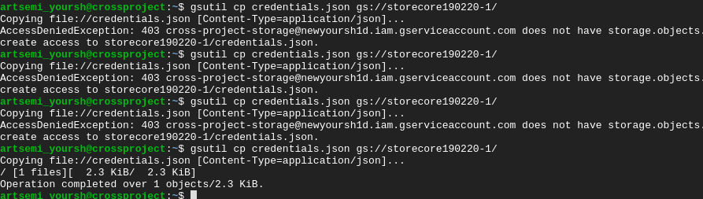

