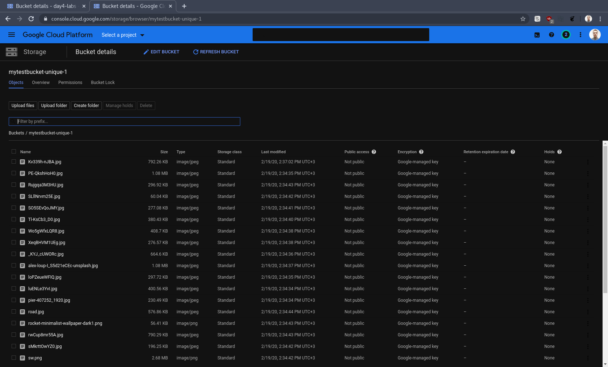

# google-cloud-module - Siarhei Kazak
# Day-4 Labs

# Today I've done the following:
## Completed lab:: https://codelabs.developers.google.com/codelabs/cloud-upload-objects-to-cloud-storage/index.html?index=..%2F..index#0
## Completed lab:: https://codelabs.developers.google.com/codelabs/es003l-storage/index.html?index=..%2F..index#0
## Completed lab:: https://codelabs.developers.google.com/codelabs/gcp-infra-cloud-storage/index.html?index=..%2F..cloud#0

## Attaching a few screenshots

### Lab1

### Lab2

### Lab3

